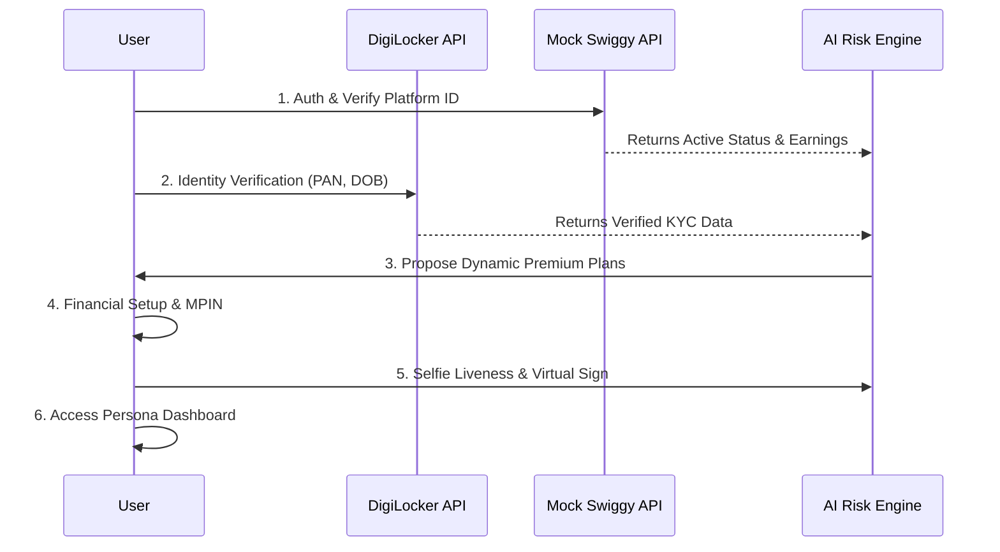
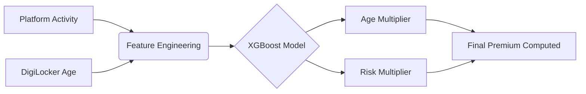

<h1 align="center">HAVEN</h1>
<h3 align="center">Parametric Income Protection for the Gig Economy</h3>

  <i>"NO WORK = NO PAY" — Securing India's 12-million-strong gig workforce.</i>

---

## 1.0 Executive Summary

By eliminating traditional indemnity insurance models, Haven adopts a **Parametric Trigger** workflow. This ensures delivery partners and gig workers receive zero-friction, instant financial support when environmental disasters or social disruptions inhibit their capacity to earn.

---

## 2.0 Problem Statement & Scenarios

Traditional insurance relies on physical damage assessment and protracted claim cycles. For the gig economy, "damage" is a 6-hour rainstorm making roads inaccessible. 

> **The Reality:** If they don't ride, they don't eat. 

**Scenario A: The High-Intensity Professional**
* **Profile:** Rajesh, 34 (Full-time in Chennai / High-Risk Zone)
* **Event:** Sudden cyclone, 8-hour waterlogging.
* **Resolution:** Under **Plan 3**, system-verified disruptions >6hrs trigger an automatic **100% daily income replacement** payout by evening. 

**Scenario B: The Supplemental Earner**
* **Profile:** Anjali, 22 (Part-time in Indore / Medium-Risk Zone)
* **Event:** Major delivery hubs blocked by protests.
* **Resolution:** Under **Plan 1**, zone status shifts to 'Disrupted'. At the 6-hour mark, she receives **70% of average earnings** automatically.

---

## 3.0 System Architecture & Workflow

The end-to-end user onboarding workflow operates across multiple secure authentication endpoints:

---

## 4.0 Premium Plan Structure

| Tier | Coverage Model | Base Rate | Wage Payout | Waiting Period |
|:---|:---|:---|:---|:---|
| **P1 - Economy** | Budget safety net | `7%` | 70% | 2 Weeks |
| **P2 - Value** | Full income for veterans | `10%` | 100% | 4 Weeks |
| **P3 - Elite** | High-priority protection | `20%` | 100% | None |

> **Formula:** `Premium = Avg Daily Salary × Base Rate × Risk Multiplier × Age Multiplier`

---

## 5.0 Technical Modules

### 5.1 Parametric Triggers
*(Content pending)*

### 5.2 Fraud Detection
*(Content pending)*

### 5.3 AI/ML Actuarial Engine

The financial logic utilizes an Automated Actuarial Engine powered by **XGBoost Regression** to normalize risk variables and dynamically calculate premiums.

* **Income Baseline:** Evaluated over a 7-30 day lookback via the Mock Swiggy API.
* **Premium Normalization:** Flattens out irregular "income spikes" (e.g., festivals).
* **Dynamic Adjustment:** Continually revises user profiles through No-Claim Bonus (NCB) checks or Geographic Risk Volatility (real-time zone risk reclassification).

---

## 6.0 Stack & Infrastructure 

#### Application Layer
| Interface | Tech Stack | Justification |
|:---|:---|:---|
| **User App** | React Native, Zustand, Expo | GPS Proof of Presence, Camera Liveness Checks for the mobile workforce |
| **Admin Panel** | Next.js, Tailwind, Recharts | High-density Risk Heatmaps & Actuarial Dashboarding for desktop viewing |

#### Infrastructure Layer
| Component | Technology | Purpose |
|:---|:---|:---|
| **Backend API** | Node.js (NestJS 10), Zod | Centralized secure validation & scalable routing |
| **Database** | Supabase (PostgreSQL) | Scalable structured storage with real-time webhooks |
| **Integrations**| OpenWeatherMap, WAQI | External API polling for parametric weather validation |
| **Automations** | @nestjs/schedule (CRON) | 15-minute weather polling, weekly claim resets |
| **DevOps** | GitHub Actions, Railway | Automated CI/CD pipelines and deployment |
