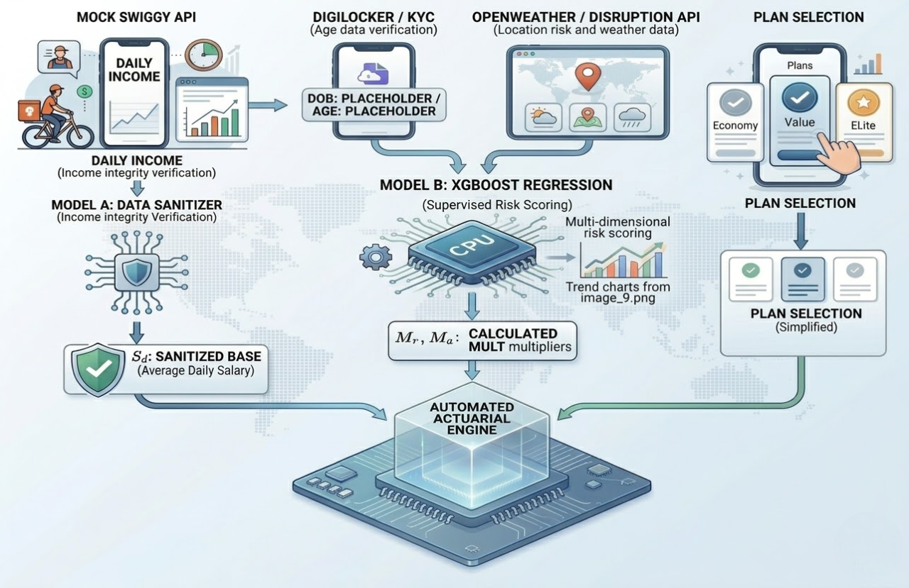
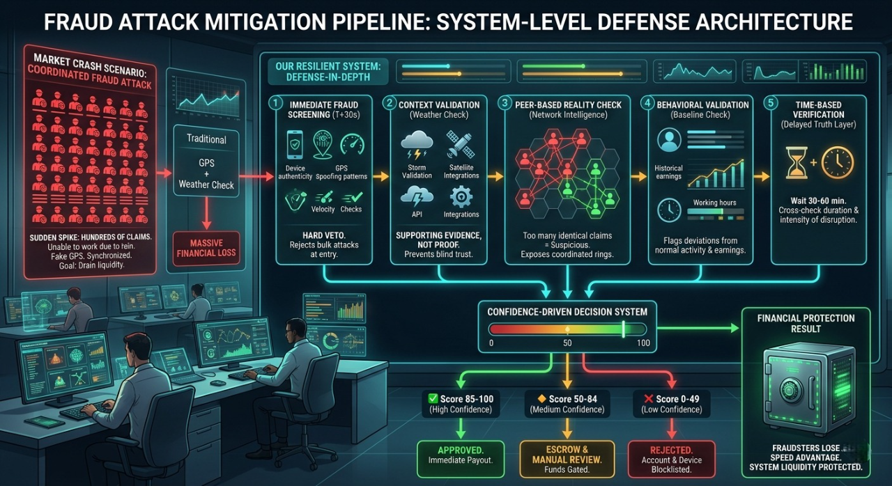

  <!-- Banner -->
  

   

  
<em>An automated, data-driven insurance ecosystem designed to protect India's 12-million-strong gig workforce.</em>

---

  <strong style="font-family: 'Courier New', monospace; font-weight: 800;">CORE DIRECTIVE</strong>

<blockquote style="font-family: 'Segoe UI', Roboto, 'Helvetica Neue', sans-serif; font-size: 1.05em; border-left: 4px solid #34495e; padding-left: 10px;">
By moving away from traditional indemnity insurance and adopting a <strong>Parametric Trigger</strong> model, Haven ensures that delivery partners and gig workers receive instant financial support when environmental disasters or social disruptions prevent them from earning.
</blockquote>

 

<!-- ───────────────────── TABLE OF CONTENTS ───────────────────── -->

<strong>📑 Table of Contents</strong>

 

| # | Section | Description |
|:---:|:---|:---|
| Ⅰ | [The Problem & Persona Scenarios](#i-the-problem--persona-scenarios) | The income-gap crisis facing gig workers |
| Ⅱ | [Demo](#ii-demo) | Live product demonstration |
| Ⅲ | [End-to-End User Workflow (Onboarding)](#iii-end-to-end-user-workflow-onboarding) | Step-by-step onboarding journey |
| Ⅳ | [Premium Plans](#iv-premium-plans) | Tiered pricing — Economy, Value & Elite |
| Ⅴ | [Platform Choices Justification](#v-platform-choices-justification) | Why native mobile + web portal |
| Ⅵ | [Parametric Triggers](#vi-parametric-triggers) | Event-based automated payout logic |
| Ⅶ | [AI/ML Integration](#vii-aiml-integration) | XGBoost pricing & dynamic risk models |
| Ⅷ | [Adversarial Defence & Anti-Spoofing](#viii-adversarial-defence--anti-spoofing) | System resilience against manipulation |
| Ⅸ | [The 3-Layer Fraud Detection Engine](#ix-fraud-detection) | Multilayer temporal anomaly detection |
| Ⅹ | [Technology Stack](#x-technology-stack) | Full-stack architecture overview |
| Ⅺ | [Development Plan](#xi-development-plan) | Roadmap & implementation milestones |
| Ⅻ | [Terms and Conditions](#xii-terms-and-conditions) | Parametric finality & algorithmic governance |
| ⅩⅢ | [References & Data Sources](#xiii-references) | Authority datasets, govt standards & ML academics |

---

<h3 id="i-the-problem--persona-scenarios" style="font-family: Verdana, Geneva, sans-serif; font-weight: 600; letter-spacing: 1px;">I. THE PROBLEM & PERSONA SCENARIOS</h3>

<strong style="font-family: 'Courier New', monospace; font-size: 1.1em; color: #2c3e50; font-weight: 800;">THE "INCOME GAP" REALITY</strong>

India's gig delivery workforce — over <strong>12 million</strong> independent contractors working for Swiggy, Zomato, Zepto, and similar platforms — operates without <em>any</em> employer safety net. They earn between <strong>₹8,000 – ₹25,000/month</strong> depending on hours and city, ride petrol bikes, electric scooters, or bicycles, and have UPI-linked bank accounts via PhonePe, Google Pay, or Paytm.

Traditional insurance requires physical damage, claim filing, adjuster visits, and weeks of waiting. But for a gig worker, "damage" isn't a broken bike — it's a <strong>6-hour rainstorm</strong> that floods the roads, a <strong>hazardous AQI day</strong> in Delhi that makes breathing dangerous, a <strong>2-hour platform outage</strong> during peak dinner rush, or a <strong>state-imposed curfew</strong> that shuts down all movement.

<blockquote><strong>"NO WORK = NO PAY"</strong> — If they don't ride, they don't eat. There is no sick leave, no employer compensation, no fallback.</blockquote>

 

<strong style="font-family: 'Courier New', monospace; font-size: 1.1em; color: #2c3e50; font-weight: 800;">PERSONA SCENARIOS</strong>

<strong>SCENARIO A — RAIN_EXTREME: Rajesh, 34 · Chennai · Full-time · Pro Plan</strong>

 
<ul>
  <li><strong>Who:</strong> Rajesh is a full-time Swiggy delivery partner in Chennai, a Tier-1 city in the cyclone belt (City Risk Index: 1.28). He works 55+ hours/week on a petrol bike and earns ~₹900/day.</li>
  <li><strong>Event:</strong> Cyclone Michaung makes landfall. Cumulative rainfall crosses <strong>64.5mm in 24 hours</strong> across his delivery zone. Roads are waterlogged for 8+ hours.</li>
  <li><strong>What happens:</strong> Haven's weather CRON detects the threshold breach via OWM + IMD cross-verification at Rajesh's GPS coordinates. A <code>RAIN_EXTREME</code> trigger event is created automatically. The 36-hour pipeline fires: Track A fraud pre-screen passes in 12 seconds, Track B live weather confirms active rainfall (code 502), Track C finds that <strong>78% of nearby workers</strong> within 2km also went offline. By T+15 minutes, confidence score hits <strong>87/100</strong> → Gate 1 fires a fast-track escrow hold.</li>
  <li><strong>Resolution:</strong> Track E historical weather confirms 94mm rainfall at station-level accuracy by T+4 hours. Escrow releases. Rajesh receives <strong>₹900 (100% daily income)</strong> via UPI by evening. No forms. No calls. No waiting.</li>
</ul>

<strong>SCENARIO B — AQI_SEVERE: Vikram, 28 · Delhi · Full-time · Economy Plan</strong>

 
<ul>
  <li><strong>Who:</strong> Vikram delivers for Zomato in North Delhi during the November–January smog season. He works 40 hours/week on an electric scooter. Delhi has the highest AQI risk in India (CRI: 1.25).</li>
  <li><strong>Event:</strong> AQI crosses <strong>300</strong> at 8 AM and stays above the hazardous threshold for <strong>6 consecutive hours</strong>. The CPCB station nearest to Vikram's route confirms sustained severe air quality.</li>
  <li><strong>What happens:</strong> Haven's AQI monitoring via WAQI.info detects the 4-hour sustained breach. The system waits for the required duration, then fires a <code>AQI_SEVERE</code> trigger. Peer corroboration shows <strong>62% of nearby workers</strong> reduced activity or went offline.</li>
  <li><strong>Resolution:</strong> Vikram receives <strong>70% of his average daily earnings</strong> (Economy plan coverage) deposited to his PhonePe UPI by the next morning.</li>
</ul>

<strong>SCENARIO C — HEAT_EXTREME: Lakshmi, 40 · Hyderabad · Part-time · Lite Plan</strong>

 
<ul>
  <li><strong>Who:</strong> Lakshmi is a part-time delivery partner, working afternoon shifts on a bicycle. She earns ~₹400/day and enrolled in the Lite plan for basic coverage.</li>
  <li><strong>Event:</strong> Hyderabad records <strong>46°C for two consecutive days</strong> in May. The IMD issues an official heat alert advisory. Outdoor work becomes genuinely dangerous.</li>
  <li><strong>What happens:</strong> Haven confirms the consecutive-day threshold via OWM and IMD heat advisories. Track D baseline calculation compares her earnings to the same days in prior weeks, confirming she would have been actively working.</li>
  <li><strong>Resolution:</strong> Lakshmi receives <strong>₹280</strong> (70% of her ₹400 daily baseline), covering the lost shift that heat made unsafe.</li>
</ul>

<strong>SCENARIO D — PLATFORM_OUTAGE: Arjun, 25 · Mumbai · Full-time · Pro Plan</strong>

 
<ul>
  <li><strong>Who:</strong> Arjun is a top-rated Swiggy partner in Mumbai, working peak dinner hours (6 PM–10 PM) when earnings are highest. He earns ~₹1,200/day.</li>
  <li><strong>Event:</strong> The Swiggy platform goes down at <strong>7:15 PM</strong>. Haven's HTTP probes to three Swiggy data centers (Mumbai, Chennai, Delhi) all return failures simultaneously. The outage lasts <strong>2 hours 40 minutes</strong> during the defined peak window.</li>
  <li><strong>What happens:</strong> All three DC probes must fail (to eliminate regional network issues vs. genuine outage). After the 120-minute threshold, a <code>PLATFORM_OUTAGE</code> trigger fires. Track C peer corroboration is naturally 100% — every worker on the platform was affected.</li>
  <li><strong>Resolution:</strong> Arjun receives <strong>₹1,200 (100% daily income)</strong> by next morning. The platform being down is the proof — no worker testimony needed.</li>
</ul>

<strong>SCENARIO E — SOCIAL_DISRUPTION: Anjali, 22 · Indore · Part-time · Economy Plan</strong>

 
<ul>
  <li><strong>Who:</strong> Anjali is a college student working part-time shifts in Indore (Medium-Risk Zone). She uses her gig earnings to pay for tuition.</li>
  <li><strong>Event:</strong> A state <em>bandh</em> (general strike) is declared. Roads are blocked, and a government-imposed movement restriction lasts <strong>8 hours</strong>. The PIB (Press Information Bureau) confirms the announcement.</li>
  <li><strong>What happens:</strong> Unlike weather triggers, <code>SOCIAL_DISRUPTION</code> cannot be fully automated — it requires human verification. A Haven admin confirms the government announcement and fires a manual trigger from the admin panel. Claims are created for all eligible policies in the affected city within 3–8 seconds.</li>
  <li><strong>Resolution:</strong> Anjali's dashboard shows her zone as "Disrupted." She receives <strong>70% of her average daily earnings</strong>, covering the lost shift.</li>
</ul>

 

<strong style="font-family: 'Courier New', monospace; font-size: 1.1em; color: #2c3e50; font-weight: 800;">PARAMETRIC vs TRADITIONAL — WHY IT MATTERS</strong>

| | Traditional Insurance | Haven (Parametric) |
|:---|:---:|:---:|
| **Claim Filing** | Manual forms & documentation | ❌ None — automatic |
| **Proof Required** | Worker testimony, photos, adjuster | Sensor data IS the proof |
| **Processing Time** | Weeks to months | **2–36 hours** |
| **Decision Basis** | Subjective damage assessment | Objective threshold breach |
| **Fraud Vector** | Fake/exaggerated damage | Must spoof GPS + weather + peers |
| **Worker Action** | Multiple touchpoints required | Zero — just stay enrolled |

---

<h3 id="ii-demo" style="font-family: Verdana, Geneva, sans-serif; font-weight: 600; letter-spacing: 1px;">II. DEMO</h3>

(Demo video / link coming soon)

---

<h3 id="iii-end-to-end-user-workflow-onboarding" style="font-family: Verdana, Geneva, sans-serif; font-weight: 600; letter-spacing: 1px;">III. END-TO-END USER WORKFLOW (ONBOARDING)</h3>

  <strong style="font-family: 'Courier New', monospace; font-size: 1.1em; color: #2c3e50; font-weight: 800;">1. USER ONBOARDING & APP EXPERIENCE</strong> 
  
Mobile interface screens: Digital KYC, Plan Selection, and Policy Dashboard.

  
  
      
  
  <strong style="font-family: 'Courier New', monospace; font-size: 1.1em; color: #2c3e50; font-weight: 800;">2. FULL SYSTEM ARCHITECTURE FLOW</strong> 
  
Complete end-to-end data lifecycle from trigger event to automated payout.

  

 

---

<h3 id="iv-premium-plans" style="font-family: Verdana, Geneva, sans-serif; font-weight: 600; letter-spacing: 1px;">IV. PREMIUM PLANS</h3>

<strong style="font-family: 'Courier New', monospace; font-size: 1.1em; color: #2c3e50; font-weight: 800;">PLAN 1: ECONOMY (SAFETY NET)</strong>
<ul style="margin-top: 8px; margin-bottom: 16px; font-size: 0.95em; padding-left: 20px; line-height: 1.6;">
  <li>Budget-conscious workers seeking a low-cost entry point for basic protection.</li>
  <li><strong>70%</strong> of your average daily income replacement.</li>
  <li><strong>2 weeks</strong> standard activation period.</li>
</ul>

| Age Band | Avg Daily Salary | Base Rate | Risk Zone | Weekly Premium | Daily Payout | Waiting Time |
| :---: | :---: | :---: | :---: | :---: | :---: | :---: |
| 20 - 25 | ₹600 | 7% | Low | ₹42 | ₹420 | 2 Weeks |
| 20 - 25 | ₹600 | 7% | Mid | ₹46 | ₹420 | 2 Weeks |
| 20 - 25 | ₹600 | 7% | High | ₹50 | ₹420 | 2 Weeks |
| 26 - 40 | ₹900 | 7% | Low | ₹76 | ₹630 | 2 Weeks |
| 26 - 40 | ₹900 | 7% | Mid | ₹83 | ₹630 | 2 Weeks |
| 26 - 40 | ₹900 | 7% | High | ₹91 | ₹630 | 2 Weeks |
| 40+ | ₹1,200 | 7% | Low | ₹126 | ₹840 | 2 Weeks |
| 40+ | ₹1,200 | 7% | Mid | ₹139 | ₹840 | 2 Weeks |
| 40+ | ₹1,200 | 7% | High | ₹151 | ₹840 | 2 Weeks |

 

<strong style="font-family: 'Courier New', monospace; font-size: 1.1em; color: #2c3e50; font-weight: 800;">PLAN 2: VALUE (INCOME REPLACEMENT)</strong>
<ul style="margin-top: 8px; margin-bottom: 16px; font-size: 0.95em; padding-left: 20px; line-height: 1.6;">
  <li>Full-time professionals who depend entirely on their gig earnings for their livelihood.</li>
  <li><strong>100%</strong> of your average daily income replacement.</li>
  <li><strong>4 weeks</strong> standard activation period.</li>
</ul>

| Age Band | Avg Daily Salary | Base Rate | Risk Zone | Weekly Premium | Daily Payout | Waiting Time |
| :---: | :---: | :---: | :---: | :---: | :---: | :---: |
| 20 - 25 | ₹600 | 10% | Low | ₹60 | ₹600 | 4 Weeks |
| 20 - 25 | ₹600 | 10% | Mid | ₹66 | ₹600 | 4 Weeks |
| 20 - 25 | ₹600 | 10% | High | ₹72 | ₹600 | 4 Weeks |
| 26 - 40 | ₹900 | 10% | Low | ₹108 | ₹900 | 4 Weeks |
| 26 - 40 | ₹900 | 10% | Mid | ₹119 | ₹900 | 4 Weeks |
| 26 - 40 | ₹900 | 10% | High | ₹130 | ₹900 | 4 Weeks |
| 40+ | ₹1,200 | 10% | Low | ₹180 | ₹1,200 | 4 Weeks |
| 40+ | ₹1,200 | 10% | Mid | ₹198 | ₹1,200 | 4 Weeks |
| 40+ | ₹1,200 | 10% | High | ₹216 | ₹1,200 | 4 Weeks |

 

<strong style="font-family: 'Courier New', monospace; font-size: 1.1em; color: #2c3e50; font-weight: 800;">PLAN 3: ELITE (IMMEDIATE PROTECTION)</strong>
<ul style="margin-top: 8px; margin-bottom: 16px; font-size: 0.95em; padding-left: 20px; line-height: 1.6;">
  <li>High-intensity workers in volatile or high-risk zones who need immediate financial resilience.</li>
  <li><strong>100%</strong> of your average daily income replacement.</li>
  <li><strong>0 days</strong> (Instant activation the moment you sign the policy).</li>
</ul>

| Age Band | Avg Daily Salary | Base Rate | Risk Zone | Weekly Premium | Daily Payout | Waiting Time |
| :---: | :---: | :---: | :---: | :---: | :---: | :---: |
| 20 - 25 | ₹600 | 20% | Low | ₹120 | ₹600 | 0 Days |
| 20 - 25 | ₹600 | 20% | Mid | ₹132 | ₹600 | 0 Days |
| 20 - 25 | ₹600 | 20% | High | ₹144 | ₹600 | 0 Days |
| 26 - 40 | ₹900 | 20% | Low | ₹216 | ₹900 | 0 Days |
| 26 - 40 | ₹900 | 20% | Mid | ₹238 | ₹900 | 0 Days |
| 26 - 40 | ₹900 | 20% | High | ₹259 | ₹900 | 0 Days |
| 40+ | ₹1,200 | 20% | Low | ₹360 | ₹1,200 | 0 Days |
| 40+ | ₹1,200 | 20% | Mid | ₹396 | ₹1,200 | 0 Days |
| 40+ | ₹1,200 | 20% | High | ₹432 | ₹1,200 | 0 Days |

 

  <strong>Data Source:</strong> All income benchmarks are derived from research findings at <a href="https://www.thefinthusiastic.com/post/india-gig-economy-all-you-need-to-know" style="color: #2980b9;">The Finthusiastic: India's Gig Economy</a>. These data parameters dictate how we calculate the premiums dynamically.

---

<h3 id="v-platform-choices-justification" style="font-family: Verdana, Geneva, sans-serif; font-weight: 600; letter-spacing: 1px;">V. PLATFORM CHOICES JUSTIFICATION</h3>

In designing a financial product for a 12-million-strong workforce, tech debt translates directly into operational failure. Here is exactly why we chose our tech stack.

 

<strong style="font-family: 'Courier New', monospace; font-size: 1.1em; color: #3178C6; font-weight: 800; cursor: pointer;">1. THE MOBILE APPS: REACT NATIVE (EXPO)</strong>

<ul style="margin-top: 5px; margin-bottom: 20px;">
  <li>✅ <strong>Why we chose it:</strong> The delivery partner's workplace is the road. Expo's EAS Build allowed us to compile cloud APKs instantly without local Android Studio overhead. The ecosystem specifically supports critical Indian compliance libraries like <code>react-native-signature-canvas</code> (required for IRDAI legal digital signatures).</li>
  <li>❌ <strong>What we rejected & why:</strong> <em>Flutter</em>. While performant, its ecosystem for specific digital signature and form-validation libraries isn't as robust as React Native's for our specific regulatory needs.</li>
  <li style="font-size: 0.9em; list-style-type: none; margin-top: 5px;">🔗 <strong>Proof & Research:</strong> <a href="https://docs.expo.dev/build/introduction/">Expo EAS Build Specs</a> | <a href="https://github.com/YanYuanFE/react-native-signature-canvas">RN Signature Canvas</a></li>
</ul>

<strong style="font-family: 'Courier New', monospace; font-size: 1.1em; color: #E0234E; font-weight: 800; cursor: pointer;">2. THE CORE ENGINE: NESTJS</strong>

<ul style="margin-top: 5px; margin-bottom: 20px;">
  <li>✅ <strong>Why we chose it:</strong> Insurance requires strict typings and isolated domains (Auth, Claims, Payouts). NestJS enforces a modular architecture through strict TypeScript. The built-in <code>@nestjs/schedule</code> runs our continuous weather polling CRONs without third-party dependencies.</li>
  <li>❌ <strong>What we rejected & why:</strong> <em>Express / Fastify</em>. We rejected them because they lack architectural enforcement; building a massive 15-module financial backend in pure Express easily devolves into unmaintainable spaghetti code.</li>
  <li style="font-size: 0.9em; list-style-type: none; margin-top: 5px;">🔗 <strong>Proof & Research:</strong> <a href="https://docs.nestjs.com/techniques/task-scheduling">NestJS Task Scheduling</a> | <a href="https://www.typescriptlang.org/docs/handbook/typescript-in-5-minutes.html">TypeScript in Finance</a></li>
</ul>

<strong style="font-family: 'Courier New', monospace; font-size: 1.1em; color: #3ECF8E; font-weight: 800; cursor: pointer;">3. THE DATABASE: SUPABASE (POSTGRESQL)</strong>

<ul style="margin-top: 5px; margin-bottom: 20px;">
  <li>✅ <strong>Why we chose it:</strong> The <strong>PostGIS extension</strong> allows us to run exact geographic distance calculations directly in SQL (`ST_Distance`) for our "Peer Corroboration" fraud check. <strong>Supabase Database Webhooks</strong> instantly fire our claims pipeline the exact moment an event is inserted.</li>
  <li>❌ <strong>What we rejected & why:</strong> <em>Firebase / MongoDB</em>. NoSQL databases make complex relational insurance joins (User → Policy → Claim → Payout) highly error-prone and lack native GIS geographic querying capabilities.</li>
  <li style="font-size: 0.9em; list-style-type: none; margin-top: 5px;">🔗 <strong>Proof & Research:</strong> <a href="https://postgis.net/docs/ST_Distance.html">PostGIS Geographic Queries</a> | <a href="https://supabase.com/docs/guides/database/webhooks">Supabase DB Webhooks</a></li>
</ul>

<strong style="font-family: 'Courier New', monospace; font-size: 1.1em; color: #000000; font-weight: 800; cursor: pointer;">4. SERVER HOSTING: RAILWAY</strong>

<ul style="margin-top: 5px; margin-bottom: 20px;">
  <li>✅ <strong>Why we chose it:</strong> Our system relies on continuous polling (fetching live weather every 15 mins) and midnight policy activations. We needed a persistent, always-on Node.js process that stays alive to maintain its CRON schedules.</li>
  <li>❌ <strong>What we rejected & why:</strong> <em>Vercel / Netlify (Serverless)</em>. Cold-starts wipe in-memory scheduler states between invocations, which would break our automated trigger monitors.</li>
  <li style="font-size: 0.9em; list-style-type: none; margin-top: 5px;">🔗 <strong>Proof & Research:</strong> <a href="https://docs.railway.app/">Railway Persistent Storage & Compute</a></li>
</ul>

<strong style="font-family: 'Courier New', monospace; font-size: 1.1em; color: #F97316; font-weight: 800; cursor: pointer;">5. OTP INFRASTRUCTURE: FAST2SMS</strong>

<ul style="margin-top: 5px; margin-bottom: 30px;">
  <li>✅ <strong>Why we chose it:</strong> Fast2SMS natively supports the DLT-approved transactional SMS route required by the Telecom Regulatory Authority of India (TRAI). It provides immediate APIs with no credit card required for rapid development.</li>
  <li>❌ <strong>What we rejected & why:</strong> <em>Twilio</em>. We rejected Twilio due to incredibly complex Indian DLT (Distributed Ledger Technology) registration requirements and restricting trial structures.</li>
  <li style="font-size: 0.9em; list-style-type: none; margin-top: 5px;">🔗 <strong>Proof & Research:</strong> <a href="https://trai.gov.in/telecom/sms/dlt">TRAI DLT Regulations for SMS</a> | <a href="https://docs.fast2sms.com/">Fast2SMS API Docs</a></li>
</ul>

---

<h3 id="vi-parametric-triggers" style="font-family: Verdana, Geneva, sans-serif; font-weight: 600; letter-spacing: 1px;">VI. PARAMETRIC TRIGGERS</h3>

<strong style="font-family: 'Courier New', monospace; font-size: 1.1em; color: #2c3e50; font-weight: 800;">
DUAL PARAMETRIC TRIGGER MODEL
</strong>

Haven operates on a strictly defined <strong>Dual Trigger Parametric Model</strong>, where claims are not user-initiated but automatically activated when objective, verifiable conditions are satisfied. 
These triggers are derived from real-time environmental signals and network-level behavioral disruptions, ensuring zero subjectivity and high fraud resistance.

<strong style="font-family: 'Courier New', monospace; font-size: 1.1em; color: #2c3e50; font-weight: 800;">
1. ENVIRONMENTAL TRIGGER (EXTERNAL DISRUPTION SIGNAL)
</strong>

This trigger activates when adverse environmental conditions materially impact delivery operations within a defined geographic cluster.

<ul>
  <li><strong>Data Source:</strong> Real-time Weather APIs + Historical Weather Validation</li>
  <li><strong>Primary Condition:</strong> Rainfall intensity ≥ 2.5 mm/hr OR severe AQI thresholds</li>
  <li><strong>Geo-Scope:</strong> Worker's live GPS coordinates mapped to city grid</li>
</ul>

<strong>Multi-Layer Validation (from system architecture):</strong>

<ul>
  <li><strong>Track B (Live Weather Engine):</strong>
    <ul>
      <li>Continuously ingests real-time weather signals</li>
      <li>Generates initial disruption confidence (+0 to +15)</li>
    </ul>
  </li>

  <li><strong>Track E (Historical Weather Engine):</strong>
    <ul>
      <li>Validates rainfall consistency using historical datasets</li>
      <li>Acts as <strong>Final Verdict Signal</strong> (+0 to +50)</li>
    </ul>
  </li>
</ul>

<strong>Trigger Condition:</strong>  
Environmental trigger is considered <strong>ACTIVE</strong> when:

Weather_Severity ≥ Threshold  AND  Historical_Validation = TRUE

This ensures that transient API spikes or false weather readings do not trigger payouts.

<strong style="font-family: 'Courier New', monospace; font-size: 1.1em; color: #2c3e50; font-weight: 800;">
2. BEHAVIORAL TRIGGER (NETWORK DISRUPTION SIGNAL)
</strong>

This trigger activates when platform-level inefficiencies indicate systemic disruption affecting multiple workers simultaneously.

<ul>
  <li><strong>Core Signals:</strong>
    <ul>
      <li>Prolonged waiting time (idle state while online)</li>
      <li>Delivery delays across multiple workers</li>
    </ul>
  </li>
</ul>

<strong>Multi-Track + ML Validation:</strong>

<ul>
  <li><strong>Track C (Peer Corroboration Engine):</strong>
    <ul>
      <li>Analyzes workers within a 2 km radius</li>
      <li>Computes disruption ratio (affected vs active workers)</li>
      <li>Validates network-wide consistency (+0 to +25)</li>
    </ul>
  </li>

  <li><strong>Track D (Baseline Income Engine):</strong>
    <ul>
      <li>Compares current earnings vs 3-week historical baseline</li>
      <li>Detects abnormal drop in hourly income</li>
      <li>Estimates financial impact (+0 to +10)</li>
    </ul>
  </li>

  <li><strong>ML Scoring Layer:</strong>
    <ul>
      <li>Aggregates behavioral anomalies into a disruption probability score</li>
      <li>Filters noise using learned patterns of normal vs disrupted demand cycles</li>
    </ul>
  </li>
</ul>

<strong>Trigger Condition:</strong>

(Avg_Wait_Time ↑ AND Multi_User_Delay = TRUE)   
AND   
Disruption_Ratio ≥ Critical_Threshold

This ensures that individual inefficiencies do not trigger claims—only systemic failures do.

<strong style="font-family: 'Courier New', monospace; font-size: 1.1em; color: #2c3e50; font-weight: 800;">
3. TRIGGER SYNCHRONIZATION LOGIC
</strong>

A claim is activated only when both triggers align within a temporal window, ensuring causality between environmental conditions and economic disruption.

FINAL TRIGGER = ENVIRONMENTAL_TRIGGER ∩ BEHAVIORAL_TRIGGER

<ul>
  <li>Prevents false positives from isolated weather or platform noise</li>
  <li>Ensures high-confidence parametric payouts</li>
  <li>Feeds directly into the Confidence Aggregation Engine (0–100 scoring)</li>
</ul>

<strong style="font-family: 'Courier New', monospace; font-size: 1.1em; color: #2c3e50; font-weight: 800;">
4. FRAUD GUARDRAIL (HARD VETO LAYER)
</strong>

<ul>
  <li>GPS spoof detection</li>
  <li>Device fingerprint validation</li>
  <li>Blacklist checks</li>
</ul>

<strong>Override Rule:</strong>

Fraud_Flag = TRUE → Trigger Invalidated (Hard Veto)

This ensures that even if both triggers are satisfied, fraudulent sessions are terminated before payout execution.

 

<strong style="font-family: 'Courier New', monospace; font-size: 1.1em; color: #2c3e50; font-weight: 800;">THE FIVE COVERED DISRUPTIONS</strong>

Haven covers exactly <strong>five parametric trigger events</strong>. Each has a precisely defined threshold, an objective external data source, and requires zero worker testimony or documentation.

| # | Trigger | Threshold | Data Source | Rationale |
|:---:|:---|:---|:---|:---|
| 1 | 🌧️ **RAIN_EXTREME** | ≥ 64.5mm rainfall in 24h | OpenWeatherMap + IMD | IMD "heavy rainfall" — roads flood, orders stop |
| 2 | 🌫️ **AQI_SEVERE** | AQI ≥ 300 sustained for 4+ hours | WAQI.info + CPCB | CPCB "hazardous" — outdoor work causes health harm |
| 3 | 🔥 **HEAT_EXTREME** | ≥ 45°C for 2+ consecutive days | OWM + IMD heat alerts | Physiological danger for outdoor motorbike riders |
| 4 | 📱 **PLATFORM_OUTAGE** | Platform down ≥ 120min during peak hours | HTTP probes (3 data centers) | Peak = 11am–2pm or 6pm–10pm; all 3 DCs must fail |
| 5 | 🚫 **SOCIAL_DISRUPTION** | Curfew/bandh ≥ 6 hours | PIB RSS + govt announcements | Requires human verification; cannot be fully automated |

 

<strong style="font-family: 'Courier New', monospace; font-size: 1.1em; color: #2c3e50; font-weight: 800;">WHY THESE FIVE — AND NOT OTHERS?</strong>

Several triggers were considered and deliberately rejected because they violate the <strong>parametric model</strong> — they cannot be verified from external objective data alone:

| Rejected Trigger | Reason for Rejection |
|:---|:---|
| 🏍️ Vehicle theft | Requires loss assessment and documentation — not parametric |
| 🏥 Health emergencies | Personal, not zone-wide; needs medical records — non-parametric |
| 📉 Earnings drop | Could result from poor performance rather than external events |
| 🔧 Vehicle breakdown | Cannot be verified externally without inspection |

The five chosen triggers are all <strong>verifiable from external objective data sources</strong> (weather APIs, platform monitoring, government announcements) without requiring any worker testimony, documentation, or adjuster involvement. This is what makes Haven truly parametric.

---

<h3 id="vii-aiml-integration" style="font-family: Verdana, Geneva, sans-serif; font-weight: 600; letter-spacing: 1px;">VII. AI/ML INTEGRATION</h3>

  

 

<strong style="font-family: 'Courier New', monospace; font-size: 1.1em; color: #2c3e50; font-weight: 800;">DEDICATED AI/ML MODELS & PIPELINES</strong>

To operate a sustainable parametric insurance pool at scale without human adjusters, Haven relies on four specific classes of machine learning and algorithmic models.

| Model / Algorithm | System Domain | The "Why" (Justification) |
|:---|:---|:---|
| 🌳 **XGBoost Classifier** | **Fraud Detection (Layer 3)** | Resolves the limitations of explicit rule-based fraud checks. Trained on historical `CONFIRMED` and `FALSE_POSITIVE` analyst labels to detect incredibly subtle, non-linear fraud rings (e.g. coordinated multi-device GPS spoofing) that static if/else logic misses. |
| 📈 **Multiple Regression** | **Dynamic Premium Pricing** | Replaces static quarterly pricing. Predicts dynamic City Risk Index (CRI) values weekly by correlating weather API forecasting trends against historical loss ratios, allowing the insurance pool to adapt instantly to rapid climate changes. |
| 👁️ **Computer Vision (CNN)** | **V-KYC & Onboarding** | Employs facial recognition and liveness detection. It compares the worker's live selfie against the official UIDAI/DigiLocker Aadhaar photo to mathematically guarantee identity and strictly prevent multi-account farming. |
| 🌲 **Isolation Forest** | **Peer Corroboration / Safety** | Unsupervised anomaly detection. Instantly flags outliers during an event (e.g., 1 worker claims extreme flooding, but geolocation data shows 45 other workers in the exact same 2km radius continuing deliveries without disruption). |

  

<strong style="font-family: 'Courier New', monospace; font-size: 1.1em; color: #2c3e50; font-weight: 800;">DEEP DIVE: AI-DRIVEN ACTUARIAL & FRAUD ENGINE</strong>

Unlike traditional insurance that relies on post-event human adjusters, Haven's core intelligence happens proactively and concurrently.

<strong style="color: #3178C6; font-size: 1.05em;">A. THE DYNAMIC PRICING FORMULA</strong>

Every premium is custom-generated at the start of the billing cycle in real-time:

<pre style="background: #0f172a; color: #38bdf8; padding: 15px; border-radius: 6px; font-family: monospace; font-size: 1.05em; text-align: center; font-weight: bold; margin-bottom: 20px;">
Premium = Avg Daily Salary × Base Rate × Risk Multiplier × Age Multiplier
</pre>

Our AI analyzes the following variables to compute the exact pricing per user without manual underwriting:

| Variable Model | Data Source & Mechanism | Actuarial Application |
|:---|:---|:---|
| 💳 **Avg Daily Salary** *(Feature Base)* | AI analyzes a **7–30 day lookback period** of transaction records pulled directly from the Mock Swiggy API to map a stable income baseline. | Ensures the payout exactly covers the worker's true lost shift wages rather than a generic flat tier. |
| 🛡️ **Base Rate** *(Plan Selection)* | Auto-assigned based on the worker's chosen coverage plan lock-in. | Sets the coverage ceiling (e.g., 7% for Plan 1 Economy, 10% for Plan 2 Target, 20% for Plan 3 Pro). |
| 🌳 **Risk & Age Multipliers** *(ML Weights)* | Dynamic adjustment weights actively predicted by our **XGBoost Regression model** utilizing multi-tensor persona and operating environment data. | A 20-year old in a high-risk flood zone gets higher multipliers than a 45-year old in a safer zone, dynamically balancing the pool. |

 

  

  

<strong style="color: #E0234E; font-size: 1.05em;">B. XGBoost: Catching "Invisible" Fraud</strong>

While Phase 1 relies on strict Gate-vetoes (like checking if GPS velocity exceeds 80km/h to catch basic app spoofing), the Phase 4 XGBoost implementation acts as the ultimate safety net.

<ul style="margin-top: 5px; margin-bottom: 20px;">
  <li><strong>Feature Engineering:</strong> The model ingests multi-dimensional tensors including battery drop rate, API request timing jitter (bots have zero jitter), and IP clustering.</li>
  <li><strong>The Goal:</strong> To catch organized fraud rings that know exactly how to bypass explicit rule-based systems but cannot perfectly mimic human behavioral randomness.</li>
</ul>

<strong style="color: #F97316; font-size: 1.05em;">C. Isolation Forest: The Data Sanitizer</strong>

While Phase 1 relies on identifying simple outliers, the Isolation Forest implementation acts as our primary defense for income integrity.

<ul style="margin-top: 5px; margin-bottom: 20px;">
  <li><strong>Feature Engineering:</strong> The model ingests multi-dimensional tensors including daily earnings, order count, average order value, and peak transaction frequency.</li>
  <li><strong>The Goal:</strong> To isolate "Pump and Dump" schemes by identifying artificial spikes in earnings that don't match typical human work patterns or city-wide medians.</li>
</ul>

<strong style="color: #3ECF8E; font-size: 1.05em;">D. Real-Time Autonomous Rebalancing</strong>

An insurance pool goes bankrupt if claims exceed premiums. The AI continuously monitors the <strong>Weekly Loss Ratio</strong> (Payouts / Premiums).

<ul style="margin-top: 5px;">
  <li>If the loss ratio creeps above <strong>80%</strong>, the Regression model automatically applies a dampening weight to high-risk zones, slightly increasing new premiums to safeguard the pool's solvency.</li>
  <li>Conversely, users with an 8-week clean record receive automated <strong>12% No-Claim Bonus (NCB)</strong> tier advancements managed purely by the algorithm.</li>
</ul>

---

<h3 id="viii-adversarial-defence--anti-spoofing" style="font-family: Verdana, Geneva, sans-serif; font-weight: 600; letter-spacing: 1px;">VIII. ADVERSARIAL DEFENCE & ANTI-SPOOFING</h3>

  

 

To ensure the integrity of the parametric insurance pool, Haven operates on a <strong>Zero-Trust Paranoia</strong> architecture. Given that delivery zones are vast and workers are fully remote, we leverage advanced spatial indexing and AI-driven security (AI Sec) to prevent systematic adversarial exploitation.

<strong style="font-family: 'Courier New', monospace; font-size: 1.1em; color: #2c3e50; font-weight: 800;">
SPATIAL INTELLIGENCE: UBER S3 VS. GOOGLE S2
</strong>

While Google S2 is the industry standard for spherical geometry and generalized mapping, <strong>we used Uber S3 (Hexagonal Hierarchical Spatial Index)</strong> for real-time location tracing and anti-spoofing operations.

<ul style="margin-top: 10px; margin-bottom: 25px; line-height: 1.6;">
  <li><strong>Why Uber S3 over Google S2?</strong> Google S2 maps reality onto squares, which results in variable distances between the center of a cell and its neighbors. In contrast, Uber S3 maps the world into hexagons. A hexagon has the mathematical property that the distance from its center to all neighboring centroids is exactly equal.</li>
  <li><strong>The Anti-Spoofing Advantage:</strong> When evaluating GPS teleportation or calculating "Peer Corroboration" radii, Uber S3 prevents edge false-positives. A worker cannot game the boundaries of a hexagonal grid the way they can with corner-biased S2 squares, ensuring our fraud models isolate genuine geographical anomalies perfectly.</li>
</ul>

<strong style="font-family: 'Courier New', monospace; font-size: 1.1em; color: #2c3e50; font-weight: 800;">
AI SECURITY & ADVERSARIAL DISRUPTION WORKFLOWS
</strong>

Our system actively neutralizes the three most critical fraud vectors within the gig economy. Because we operate without manual adjusters, these defenses proactively handle every edge case automatically through a strict, multi-layered verification matrix.

<strong style="color: #3178C6; font-size: 1.05em;">A. GPS SPOOFING & SPATIAL ANOMALIES</strong>

<strong>Vector / Behavior:</strong> Workers using 'Mock Locations' or root-patched APKs to fake their presence in a disrupted zone (e.g., claiming to be in flooded Chennai while sitting in Bengaluru).

| Edge Case Scenarios | AI Sec Prevention Strategy | Automated Workflow Response |
|:---|:---|:---|
| **Impossible Precision** *(Coordinates are exact round numbers like 13.0°N, 80.0°E)* | **Sensor Noise Profiling:** Real GPS hardware generates noise at the 5th-7th decimal place. AI checks for programmatic perfection. | <mark style="background-color: #fff3cd; color: #856404; padding: 2px 4px; border-radius: 4px;">Soft Flag (Watchlist):</mark> Score penalized by 15 points; claim heavily scrutinized in Gate 2. |
| **Velocity Teleportation** *(Distance shifted is physically impossible in the timeframe)* | **H3 Velocity Interpolation:** Calculates the Haversine distance and transit limits between sequential H3 hex grids. | **🛑 Hard Veto (Instant Rejection):** If a user moves >2km in <5 mins (80km/h in gridlock), claim is terminated instantly in Track A. |
| **Signal Absence** *(Device GPS module disabled mid-shift)* | **Fallback Triangulation:** System defaults to city-centroid coordinates mapped to grid averages. | <mark style="background-color: #f8bcc1; color: #721c24; padding: 2px 4px; border-radius: 4px;">Penalty Applied:</mark> Claim confidence drops 15%; requires >3x external validation to clear Escrow. |

<strong style="color: #E0234E; font-size: 1.05em;">B. IDENTITY SPOOFING & DEVICE FARMING</strong>

<strong>Vector / Behavior:</strong> Cyber syndicates renting leaked Aadhaar IDs to farm payouts, or workers sharing verified devices with unregistered proxies.

| Edge Case Scenarios | AI Sec Prevention Strategy | Automated Workflow Response |
|:---|:---|:---|
| **Deepfakes & Photo Masks** *(Using a printed photo to bypass KYC)* | **Native CNN Liveness Testing:** Edge-computing tasks prompting micro-motions (e.g., blinking/smiling) verified at 60fps. | **❌ Session Lockout:** Instant rejection of V-KYC pipeline. Registration token revoked immediately. |
| **Proxy Verification** *(Unregistered user passing liveness but failing identity)* | **Biometric Hash Comparison:** Algorithms map the live 3D-facial-topology against official government UIDAI/DigiLocker photo databases. | **🛡️ Identity Rejection:** Similarity drop below 98% results in failure. No manual override allowed. |
| **Device Farming** *(Multiple IDs claiming payouts from the same physical smartphone)* | **Encrypted Device Fingerprinting:** Tokenizing the hardware signature and checking for Account/Device 1-to-many anomalies in Track A. | **🚫 Immediate Account Ban:** 3 strikes trigger global blacklisting cascading across User ID, Phone Number, and Aadhaar Hash. |

<strong style="color: #3ECF8E; font-size: 1.05em;">C. BEHAVIORAL SPOOFING & THE WORK CONTINUITY PARADOX</strong>

<strong>Vector / Behavior:</strong> A worker falsely files a heavy rain interruption claim, but continues to secretly complete "invisible" deliveries on the food network.

| Edge Case Scenarios | AI Sec Prevention Strategy | Automated Workflow Response |
|:---|:---|:---|
| **Concurrent Activity** *(Worker completes Swiggy order during claimed disruption window)* | **Platform Semantic Tracking:** NestJS intercepts precise order transaction timestamps continuously from the underlying mock/real Platform DB. | **🛑 Paradox Veto:** Hard veto triggered. System explicitly trusts transactional DB data over user claim. |
| **API Timing Abuse** *(User constantly pinging weather APIs waiting to start a shift exactly when rain begins)* | **Behavioral Rhythm Analysis:** Tracking API request patterns compared to typical gig-start login times via anomaly detection. | <mark style="background-color: #d1ecf1; color: #0c5460; padding: 2px 4px; border-radius: 4px;">Elevated Scrutiny:</mark> Soft-flagged as 'Opportunistic'. Safety score multiplier penalized and Gate wait times extended. |
| **Coordinated Referral Rings** *(Multiple users under same referral code claiming simultaneously from isolated IPs)* | **Social Graph Analysis / IP Clustering:** ML identifies subnet commonalities and referral ties generating synchronized claims. | **⚠️ Analyst Intervention (Gate 3):** Fast-tracking paused; moved to manual queue for human analyst investigation. |

 

<strong>💡 INTEGRATED ZERO-TRUST ESCROW MECHANISM:</strong> Regardless of how solid a claim initially appears, <strong>money never leaves the underlying Escrow account</strong> until Gate 4 (Historical weather anomaly API) definitively validates the disruption offline. False positives generated by hyper-sophisticated adversarial spoofing simply delay the payment inside escrow, until the ground-truth confirms nothing happened—silently returning the funds to the liability pool.

---

<h3 id="ix-fraud-detection" style="font-family: Verdana, Geneva, sans-serif; font-weight: 600; letter-spacing: 1px;">IX. THE 3-LAYER FRAUD DETECTION ENGINE</h3>

Parametric insurance fraud fundamentally differs from traditional insurance fraud. Because triggers (like rain or platform outages) are geographic and environmental, fraudulent claims cannot look like random individual events. They must misrepresent <strong>location</strong>, <strong>activity</strong>, or <strong>identity</strong>. 

Haven’s fraud detection architecture is designed to <strong>Fail Safe rather than Fail Strict</strong>. When algorithmic confidence dips below the auto-rejection threshold (45%), the system escalates the claim to an analyst queue rather than outright rejecting it, minimizing false negatives for genuine gig workers.

<strong style="font-family: 'Courier New', monospace; font-size: 1.1em; color: #2c3e50; font-weight: 800;">
THE 3-LAYER VERIFICATION PIPELINE
</strong>

Every single claim is processed through a strict temporal pipeline that scales from instant rigid checks to advanced historical machine learning analysis.

<strong style="font-family: 'Courier New', monospace; font-size: 1.05em; color: #E0234E; cursor: pointer;">LAYER 1: INSTANT SIGNALS (T+0 to T+30 SECONDS)</strong>

<strong>Mechanism:</strong> Binary hard vetoes executed entirely via synchronized PostgreSQL/Supabase database queries. No external API calls are made here. If a claim fails Layer 1, it is <strong>instantly and permanently rejected</strong>.

<ul style="line-height: 1.6; font-size: 0.95em;">
  <li><strong>Waiting Period Enforcement:</strong> Evaluates if a policy was suspiciously purchased <em>immediately</em> preceding a major forecasted event. Pro plans require a 3-day wait; Economy requires 7 days. Claims inside this window are vetoed to prevent Adverse Selection.</li>
  <li><strong>Device Fingerprinting Sandbox:</strong> Verifies the physical `device_id`. If the exact same physical device has filed claims for multiple distinct worker Aadhaar IDs within 24 hours, the claim is vetoed for Account Sharing.</li>
</ul>

<strong style="font-family: 'Courier New', monospace; font-size: 1.05em; color: #F97316; cursor: pointer;">LAYER 2: EARLY WINDOW SIGNALS (T+30 SECONDS to T+2 HOURS)</strong>

<strong>Mechanism:</strong> Soft flags that analyze network and behavioral patterns. These flags do not hard-veto a claim, but aggressively raise the confidence Gate thresholds required for fast-track payout.

<ul style="line-height: 1.6; font-size: 0.95em;">
  <li><strong>IP Subnet Clustering:</strong> Checks if multiple unassociated worker claims originated from the exact same IP subnet within the same hour. This catches coordinated fraud rings operating out of shared "click-farm" locations.</li>
  <li><strong>Opportunistic API Timing:</strong> Analyzes app-level telemetry. If the user was rapidly refreshing weather-check endpoints <em>before</em> their work session started, it implies they manipulated their schedule specifically to harvest a payout.</li>
  <li><strong>Claim Velocity Checks:</strong> Monitors if a single user files claims against three or more entirely different parametric triggers (e.g., Rain, Heat, Outage) in a single week—a statistical improbability indicating systematic exploitation.</li>
</ul>

<strong style="font-family: 'Courier New', monospace; font-size: 1.05em; color: #3178C6; cursor: pointer;">LAYER 3: HISTORICAL ML ANALYSIS (T+6 HOURS AND BEYOND)</strong>

<strong>Mechanism:</strong> Deep actuarial analysis utilizing algorithmic baseline detection for long-term behavioral anomalies.

<ul style="line-height: 1.6; font-size: 0.95em;">
  <li><strong>Behavioral Baseline Shifts:</strong> If a user's claim frequency suddenly exceeds 3x their historical average, the algorithmic threshold suspends fast-track eligibility.</li>
  <li><strong>Social Graph Network Analysis:</strong> Evaluates the referral network graph. If multiple workers who were all invited by the <em>same</em> referral node simultaneously file claims in an unlikely time window, the entire cluster is flagged for coordinated syndicate fraud.</li>
  <li><strong>Seasonal Normalization:</strong> Custom ML bounds automatically adjust "suspicious" thresholds. A 40% peer-disruption rate in February might trigger analyst review, but is passed automatically in August during the monsoon season.</li>
</ul>

 

<strong style="font-family: 'Courier New', monospace; font-size: 1.1em; color: #2c3e50; font-weight: 800;">
ALGORITHMS & ML MODELS EMPLOYED
</strong>

To confidently replace human adjusting, Haven integrates rigorous mathematical and machine learning modeling schemas across the system architecture.

| Engine / Objective | Algorithm / Mathematical Formula | Implementation Workflow & Purpose |
|:---|:---|:---|
| **Geographic Corroboration** | **PostGIS ST_Distance (Haversine Formula)** | Calculates exact proximity between claimant and active gig workers. Generates the 2km querying radius essential for Track C Peer Corroboration. |
| **Peer Anomaly Detection** | **Isolation Forest (Unsupervised ML)** | Ingests thousands of simultaneous peer transaction velocity metrics to mathematically isolate "Pump and Dump" earnings behavior from standard city medians. |
| **Long-Term Pricing Solvency** | **XGBoost Regression Model** | Extracts features from weather forecasting APIs and temporal claim frequency to dynamically re-calculate the `City Risk Index (CRI)` multiplier weekly, preventing pool bankruptcy. |
| **Biometric Sybil Defense** | **Edge-CNN Liveness & Hash Mapping** | Calculates a 3D-facial-topology similarity hash against the UIDAI DB. `Sim(x,y) < 98.0% → Reject`. Ensures unique IDs are bound strictly to genuine physical humans. |

 

<strong style="font-family: 'Courier New', monospace; font-size: 1.1em; color: #2c3e50; font-weight: 800;">
THE ECONOMIC DETERRENT: SAFETY SCORE LOGIC
</strong>

Rather than merely rejecting fraudulent claims, Haven mathematically penalizes fraudsters by attacking their wallet using the <code>safety_score_multiplier</code> (SSM), creating an ongoing multi-week economic deterrence.

<pre style="background: #0f172a; color: #38bdf8; padding: 15px; border-radius: 6px; font-family: monospace; font-size: 1.05em; text-align: center; font-weight: bold; margin-bottom: 20px;">
User Premium = Base Premium × CityRisk × SafetyScoreMultiplier (SSM)
</pre>

<ul style="line-height: 1.6;">
  <li>✅ <strong>Clean Record (8 Weeks):</strong> <code>SSM = 0.88</code> (12% Discount reliably applied to all policy premiums).</li>
  <li>⚠️ <strong>Confirmed Fraud Flag:</strong> <code>SSM = SSM + 0.15</code> (Premiums permanently rise by 15% per flag. Attempting to cheat the system deliberately costs the worker more money every subsequent week).</li>
  <li>⛔ <strong>The "3 Strikes" Rule (Blacklist):</strong> If 3 distinct fraud investigations return <code>status = CONFIRMED</code> by the analyst engine, the system triggers absolute blacklisting. The ban cascades globally dropping the <code>worker_id</code>, <code>phone_number</code>, <code>device_fingerprint</code>, and <code>Aadhaar_hash</code>, blocking any cyclic re-registration attempts.</li>
</ul>

---

<h3 id="x-technology-stack" style="font-family: Verdana, Geneva, sans-serif; font-weight: 600; letter-spacing: 1px;">X. TECHNOLOGY STACK</h3>

Haven’s stack is intentionally selected to maximize type-safety across financial scopes, handle persistent continuous schedules without cold-starts, and securely orchestrate data between vast numbers of mobile clients and external authorities.

<strong style="font-family: 'Courier New', monospace; font-size: 1.1em; color: #2c3e50; font-weight: 800;">
📱 1. CLIENT INTERFACE (USER APP & SWIGGY MOCK)
</strong>

| Category | Technology | Role in System |
|:---|:---|:---|
| ⚛️ **Mobile Framework** | React Native 0.74 (Expo SDK 51) | Client UI Engine |
| 💻 **Language** | TypeScript 5.x | Strict Type Safety |
| 🛣️ **File Routing** | Expo Router v3 | File-based Stack Navigator |
| 🌐 **API Client** | Axios | Queued HTTP Request Interceptor |
| 🔐 **Token Storage** | `expo-secure-store` | Hardware-backed JWT Vault |
| 🧠 **Local State** | Zustand 4.x + Persist Middleware | Async Global State Manager |
| 📝 **Form Engine** | `react-hook-form` + Zod | Strict Client Validator |
| 🎨 **Premium Styling** | `expo-linear-gradient` | Premium Visual Aesthetics |
| ✨ **Micro-Animations** | Lottie React Native | Dynamic UI Interaction |
| 📸 **V-KYC Camera** | `expo-camera` | Edge CNN Feed Capturer |
| 👁️ **Identity Verification** | `expo-local-authentication` | Device Biometric Verifier |
| ✍️ **IRDAI Compliance** | `react-native-signature-canvas` | Base64 Protocol Signer |
| 📡 **Connectivity** | `@react-native-community/netinfo` | Live Offline State Handler |
| 🔔 **Push Reception** | `expo-notifications` | Async Foreground Receiver |
| 🏗️ **Cloud Compilation** | Expo EAS Build | Cloud APK/AAB Compiler |

 

<strong style="font-family: 'Courier New', monospace; font-size: 1.1em; color: #2c3e50; font-weight: 800;">
🖥️ 2. ACTUARIAL PORTAL (ADMIN WEB APP)
</strong>

| Category | Technology | Role in System |
|:---|:---|:---|
| 🏗️ **Web Framework** | Next.js 14 App Router | React Web Architecture |
| 🎨 **Styling Engine** | Tailwind CSS 3.x | Utility-first CSS Engine |
| 🧩 **Component Library** | shadcn/ui | Headless Radix Components |
| ⚡ **Data Fetching** | TanStack Query v5 (`react-query`) | Async API Caching Layer |
| 📡 **HTTP Interceptor** | Axios | Admin JWT Attacher |
| 📊 **Metric Visualization** | Recharts | Actuarial Charting Toolkit |
| 🛡️ **Schema Validation** | Zod + `react-hook-form` | Deep Type Validations |
| 🔑 **Auth Persistence** | LocalStorage API | Stateless Token Store |
| 📦 **Static Export** | `next export` | Pre-rendered HTML Engine |
| 🖼️ **Iconography** | `lucide-react` | Clean Vector Glyphs |
| ⏱️ **Format Utilities** | `date-fns` & `clsx` | Dynamic Class/Date Manipulator |
| 🌍 **CDN Deployment** | Firebase Hosting Server | Global Edge Network Delivery |

 

<strong style="font-family: 'Courier New', monospace; font-size: 1.1em; color: #2c3e50; font-weight: 800;">
⚙️ 3. CORE BACKEND ENGINE
</strong>

| Category | Technology | Role in System |
|:---|:---|:---|
| 🦁 **Server Framework** | NestJS 10.x | Modular Architecture Enforcer |
| 🟢 **Execution Runtime** | Node.js 20 LTS | Async V8 Runtime |
| 🗄️ **Database Binding** | `@supabase/supabase-js` v2 | Direct PostgREST Query Builder |
| 🕒 **Background Cron** | `@nestjs/schedule` | Persistent Polling Scheduler |
| 🛂 **Auth Middleware** | Passport JWT (`@nestjs/passport`) | JWT Route Protection |
| 🛑 **Rate Limiter** | `@nestjs/throttler` | OTP Abuse Preventer |
| 🧹 **Data Sanitization** | `class-validator` & `class-transformer` | DTO Validation Pipe |
| 📢 **Notification Dispatch** | `firebase-admin` SDK | Server Push Dispatcher |
| 🌐 **HTTP Module** | `@nestjs/axios` | External Webhook Caller |
| ⛑️ **Security Headers** | Helmet | HTTP Security Middleware |
| 🗜️ **Payload Optimization** | Compression Middleware | Gzip Bandwidth Optimizer |
| 🎛️ **Process Management** | Standard Procfile | Native Boot Instructor |
| 📖 **API Documentation** | `@nestjs/swagger` | OpenAPI Spec Generator |
| 🚂 **Cloud Hosting** | Railway | Always-on Persistent Server |

 

<strong style="font-family: 'Courier New', monospace; font-size: 1.1em; color: #2c3e50; font-weight: 800;">
☁️ 4. INFRASTRUCTURE & THIRD-PARTY APIS
</strong>

| Category | Technology | Role in System |
|:---|:---|:---|
| 🐘 **Relational Database** | Supabase PostgreSQL | Primary ACID Datastore |
| 🗺️ **Spatial Engine** | PostGIS PostgreSQL Extension | Geographic Radius Corroborator |
| ⚡ **Database Webhooks** | Supabase Triggers | Instant Event Dispatcher |
| 💬 **OTP SMS Gateway** | Fast2SMS REST API | DLT-approved Trigger Route |
| 🔔 **Global Push Network** | Firebase Cloud Messaging (FCM) | Reliable APNS/FCM Delivery |
| 🌤️ **Live Weather Feed** | OpenWeatherMap Current API | Fast T+0 Weather Monitor |
| ⏳ **Historical Weather Trace** | OWM Timemachine API | Deep Historical Verification |
| 🏭 **Government Air Data** | WAQI.info REST API | CPCB Ground Sensor Feed |
| 📜 **Base Climate History** | IMD Open Data Archives | Primary Baseline Comparison |
| 💳 **Financial Escrow** | Razorpay Transactions API | Direct UPI Disbursal Gateway |
| 🤖 **Automated Deployment** | GitHub Actions | Parallel CI/CD Pipelines |

---

<h3 id="xi-development-plan" style="font-family: Verdana, Geneva, sans-serif; font-weight: 600; letter-spacing: 1px;">XI. DEVELOPMENT PLAN</h3>

Haven is structurally designed to transition from a conceptual pilot into a national safety-net infrastructure. The roadmap is divided into three distinct evolutionary stages: <strong>Next</strong>, <strong>Scale</strong>, and <strong>Soar</strong>.

<strong style="font-family: 'Courier New', monospace; font-size: 1.1em; color: #2c3e50; font-weight: 800;">
🚀 1. THE NEXT PHASE (BETA CAPTURE & REFINEMENT)
</strong>

The immediate tactical objective focusing on hardening the core predictive engines and establishing the primary actuarial baseline in controlled testbeds.

<ul style="line-height: 1.6; margin-bottom: 25px;">
  <li><strong>Closed-Beta Launch (1,000 Users):</strong> Onboarding the first cluster of delivery partners strictly inside the Bengaluru and Chennai grids to train localized weather models.</li>
  <li><strong>Real-World Stress Testing:</strong> Validating the <em>Track C (Peer Corroboration Engine)</em> in live environments to fine-tune the spatial mapping radius.</li>
  <li><strong>V-KYC Integration Complete:</strong> Finalizing the CNN Edge-liveness algorithms against live, shifting hardware environments (varying budget phone camera qualities).</li>
  <li><strong>B2B Partnerships (Initial):</strong> Establishing formal API sandbox access with aggregator networks (e.g., Swiggy or Zomato) to replace the current Mock API architecture.</li>
</ul>

<strong style="font-family: 'Courier New', monospace; font-size: 1.1em; color: #3178C6; font-weight: 800;">
📈 2. THE SCALE PHASE (MARKET EXPANSION)
</strong>

Transitioning from a limited beta into an economically sustainable operation by diversifying the trigger portfolio and drastically expanding the liquidity pool.

<ul style="line-height: 1.6; margin-bottom: 25px;">
  <li><strong>Multi-City Rollout:</strong> Expanding operational H3 grids to Tier-2 cities (e.g., Pune, Hyderabad, Kochi) where platform dependency is high but weather constraints vary drastically.</li>
  <li><strong>Automated Actuarial Solvency:</strong> Activating the full <em>XGBoost Regression Model</em> to autonomously adjust Tier 1/2/3 premiums without any backend engineer intervention.</li>
  <li><strong>Expanded Parametric Triggers:</strong> Introducing bespoke triggers beyond weather, such as localized <em>Network Blackouts</em> or <em>ISP Failures</em> causing dead zones.</li>
  <li><strong>Liquidity Pool Hedging:</strong> Integrating programmatic limits or traditional reinsurance structures to back the central liability pool against single "Black Swan" events (e.g., a massive cyclone hitting 3 states simultaneously).</li>
</ul>

<strong style="font-family: 'Courier New', monospace; font-size: 1.1em; color: #E0234E; font-weight: 800;">
🦅 3. THE SOAR PHASE (ECOSYSTEM DOMINANCE)
</strong>

Establishing Haven as the default, underlying API infrastructure powering micro-insurance across the entire Southeast Asian gig economy.

<ul style="line-height: 1.6; margin-bottom: 25px;">
  <li><strong>Native B2B Component Integrations:</strong> Transitioning from a purely D2C app to a seamless Embedded API (B2B2C). Delivery apps can embed the "Haven Shield" directly into their own UI for 1-click driver opt-in.</li>
  <li><strong>Multi-Vertical Agnostic Triggers:</strong> Adapting the disruption matrices to instantly cover other sectors: Urban Company plumbers (transit issues), Porter truck drivers, and Rapido bike-taxis.</li>
  <li><strong>Predictive Pre-Payouts:</strong> Advancing the ML models so heavily that Haven can initiate payouts based on a <em>99% certainty forecast</em> before the worker even opens the app to file a claim.</li>
  <li><strong>Global Sovereign Integrations:</strong> Feeding our proprietary grid disruption heatmaps back to governmental infrastructure bodies for real-time traffic and road-flood management via Open Data APIs.</li>
</ul>

---

<h3 id="xii-terms-and-conditions" style="font-family: Verdana, Geneva, sans-serif; font-weight: 600; letter-spacing: 1px;">XII. TERMS AND CONDITIONS</h3>

Usage of the Haven Platform is subject to the following binding parameters enforcing the zero-trust algorithmic framework. By participating in the algorithmic liquidity pool, users consent strictly to machine-driven governance without manual arbitration.

  <a href="Terms%20and%20Conditions.pdf" target="_blank" style="display: inline-block; padding: 12px 24px; background-color: #2c3e50; color: #ffffff; text-decoration: none; font-family: 'Courier New', monospace; font-weight: bold; border-radius: 6px; box-shadow: 0 4px 6px rgba(0,0,0,0.1);">
    📄 VIEW FULL TERMS & CONDITIONS (PDF)
  </a>

<strong style="font-family: 'Courier New', monospace; font-size: 1.1em; color: #2c3e50; font-weight: 800;">
📜 1. PARAMETRIC FINALITY (NO DISPUTE CLAUSE)
</strong>
<ul style="line-height: 1.6; margin-bottom: 25px; margin-top: 10px;">
  <li><strong>Algorithmic Verdicts:</strong> All claim decisions are mathematically derived from external data sources (OpenWeatherMap, WAQI, PostGIS, and Swiggy mock APIs). The <strong>algorithm's verdict is final and legally binding</strong>.</li>
  <li><strong>Zero Arbitration:</strong> Haven does not employ manual claims adjusters. Disputing an algorithmic rejection must be resolved by proving the source external API failed (e.g., IMD sensors went offline), not by providing subjective physical evidence.</li>
</ul>

<strong style="font-family: 'Courier New', monospace; font-size: 1.1em; color: #2c3e50; font-weight: 800;">
⚠️ 2. FRAUD AND BLACKLISTING
</strong>
<ul style="line-height: 1.6; margin-bottom: 25px; margin-top: 10px;">
  <li><strong>Economic Penalty Acceptance:</strong> Users acknowledge that triggering an AI-Security Soft Flag will algorithmically raise their subsequent premiums by exactly 15% via the Safety Score Multiplier (SSM) algorithm.</li>
  <li><strong>Absolute Identity Enforcement:</strong> Submitting claims on a device belonging to a different Aadhaar-verified individual violates the V-KYC integrity clause. Upon Three (3) confirmed security strikes, the User's UIDAI Hash, Mobile Number, and Device IMEI will be <strong>permanently hardware-banned</strong>.</li>
</ul>

<strong style="font-family: 'Courier New', monospace; font-size: 1.1em; color: #2c3e50; font-weight: 800;">
⏳ 3. WAITING PERIODS & PAYOUT LIMITATIONS
</strong>
<ul style="line-height: 1.6; margin-bottom: 25px; margin-top: 10px;">
  <li><strong>Anti-Adverse Selection:</strong> Economy plans are subject to a strict 7-day waiting period, and Target/Pro plans to a 3-day waiting period. Pre-purchasing policies moments before a forecasted cyclone explicitly violates these terms.</li>
  <li><strong>Escrow Timing Limits:</strong> All valid funds are locked in algorithmic Escrow until Gate 4 Historical validation occurs. Haven assumes zero liability for settlement delays originating from our disbursement Gateway (Razorpay) routing nodes.</li>
  <li><strong>Pool Solvency Constraints:</strong> In extreme Black Swan tail-risk events causing catastrophic multi-state insolvency across the primary pool, the maximum payload liability is programmatically capped, triggering a proportional mathematical haircut across all pending claims to preserve systematic solvency.</li>
</ul>

<strong style="font-family: 'Courier New', monospace; font-size: 1.1em; color: #2c3e50; font-weight: 800;">
👁️ 4. DATA TELEMETRY AND PRIVACY
</strong>
<ul style="line-height: 1.6; margin-bottom: 25px; margin-top: 10px;">
  <li><strong>Background Sensory Monitoring:</strong> By using the Haven Mobile Application, users explicitly permit background geolocation sampling (H3 Cell tracking), IP-subnet clustering, and OS-level semantic interaction tracking strictly within the scope of evaluating "Work Continuity".</li>
  <li><strong>Liveness Hashing:</strong> Edge-CNN 3D facial topologies captured during V-KYC are converted into one-way secure cryptographic biometric hashes for UIDAI verification and are <strong>never stored</strong> as raw unencrypted image assets in our Supabase datastore.</li>
</ul>

By onboarding to Haven, gig workers, administrative agents, and third-party API aggregators agree to operate exclusively under the mathematically verifiable architecture defined above. Continued usage assumes implicit and explicit acceptance of all algorithm-driven rulings.

---

<h3 id="xiii-references" style="font-family: Verdana, Geneva, sans-serif; font-weight: 600; letter-spacing: 1px;">XIII. REFERENCES & AUTHORITY DATA SOURCES</h3>

Haven’s parametric architecture is built upon and mathematically validated by the following authoritative national frameworks, academic algorithms, and open-source intelligence matrices.

<strong style="font-family: 'Courier New', monospace; font-size: 1.1em; color: #2c3e50; font-weight: 800;">
🏛️ 1. GOVERNMENT & REGULATORY INFRASTRUCTURE
</strong>
<ul style="line-height: 1.6; margin-bottom: 25px; margin-top: 10px;">
  <li><strong>NITI Aayog (Govt. of India):</strong> <a href="https://niti.gov.in/sites/default/files/2022-06/Policy_Brief_India%27s_Booming_Gig_and_Platform_Economy_27062022.pdf" target="_blank" style="color: #3178C6; text-decoration: none; font-weight: bold;">India's Booming Gig and Platform Economy (2022)</a> — Establishes the core 10M+ gig workforce baseline, structurally formalizing the urgent demand for social security mechanisms.</li>
  <li><strong>UIDAI (Unique Identification Authority of India):</strong> <a href="https://uidai.gov.in/" target="_blank" style="color: #3178C6; text-decoration: none; font-weight: bold;">Aadhaar Authentication Framework</a> — The underlying biometric standard defining our Edge-CNN computational hashing to strictly prevent V-KYC identity farming.</li>
  <li><strong>CPCB (Central Pollution Control Board):</strong> <a href="https://cpcb.nic.in/" target="_blank" style="color: #3178C6; text-decoration: none; font-weight: bold;">National Air Quality Index (AQI) Guidelines</a> — Legally grounds and validates our exact parametric threshold (AQI ≥ 300) for "severe respiratory disruption" payouts.</li>
</ul>

<strong style="font-family: 'Courier New', monospace; font-size: 1.1em; color: #2c3e50; font-weight: 800;">
📡 2. SPATIAL, WEATHER & CLIMATOLOGY AUTHORITY
</strong>
<ul style="line-height: 1.6; margin-bottom: 25px; margin-top: 10px;">
  <li><strong>Uber Engineering:</strong> <a href="https://h3geo.org/" target="_blank" style="color: #3178C6; text-decoration: none; font-weight: bold;">H3: Uber’s Hexagonal Hierarchical Spatial Index</a> — The primary open-source mathematical grid system fundamentally preferred over Google S2 for ensuring perfectly equal-distance neighbor mapping to enforce anti-teleportation limits.</li>
  <li><strong>IMD (India Meteorological Department):</strong> <a href="https://mausam.imd.gov.in/" target="_blank" style="color: #3178C6; text-decoration: none; font-weight: bold;">Mausam Operations Database</a> — The highest national weather authority source relied upon heavily for deep historical correlation (Gate 4) against real-time API triggers.</li>
  <li><strong>World Air Quality Index (WAQI):</strong> <a href="https://aqicn.org/api/" target="_blank" style="color: #3178C6; text-decoration: none; font-weight: bold;">Global Real-Time Air Quality Sensor API</a> — Real-time environmental intelligence grid driving immediate Track B disruption indicators.</li>
</ul>

<strong style="font-family: 'Courier New', monospace; font-size: 1.1em; color: #2c3e50; font-weight: 800;">
🤖 3. ALGORITHMIC & MACHINE LEARNING PARADIGMS
</strong>
<ul style="line-height: 1.6; margin-bottom: 25px; margin-top: 10px;">
  <li><strong>XGBoost Scientific Foundation:</strong> <a href="https://arxiv.org/abs/1603.02754" target="_blank" style="color: #3178C6; text-decoration: none; font-weight: bold;">XGBoost: A Scalable Tree Boosting System (Chen & Guestrin, 2016)</a> — The deep academic bedrock powering our Dynamic Pricing Solvency formula predicting hyper-personalized Risk Age Multipliers without human underwriting.</li>
  <li><strong>Isolation Forest:</strong> <a href="https://cs.nju.edu.cn/zhouzh/zhouzh.files/publication/icdm08b.pdf" target="_blank" style="color: #3178C6; text-decoration: none; font-weight: bold;">Isolation Forest (Liu, Ting, Zhou, 2008)</a> — The unsupervised mathematical model heavily leveraged in our 3-Layer backend to isolate Pump and Dump syndicates by identifying sub-millisecond anomalous deviations from gig-economy baselines.</li>
  <li><strong>Haversine Formula Toolkit:</strong> <a href="https://postgis.net/docs/" target="_blank" style="color: #3178C6; text-decoration: none; font-weight: bold;">PostGIS Geospatial Reference</a> — Core standard for precisely calculating spherical distance variances to flag GPS Velocity Anomalies dynamically on coordinate-tracked devices.</li>
</ul>

