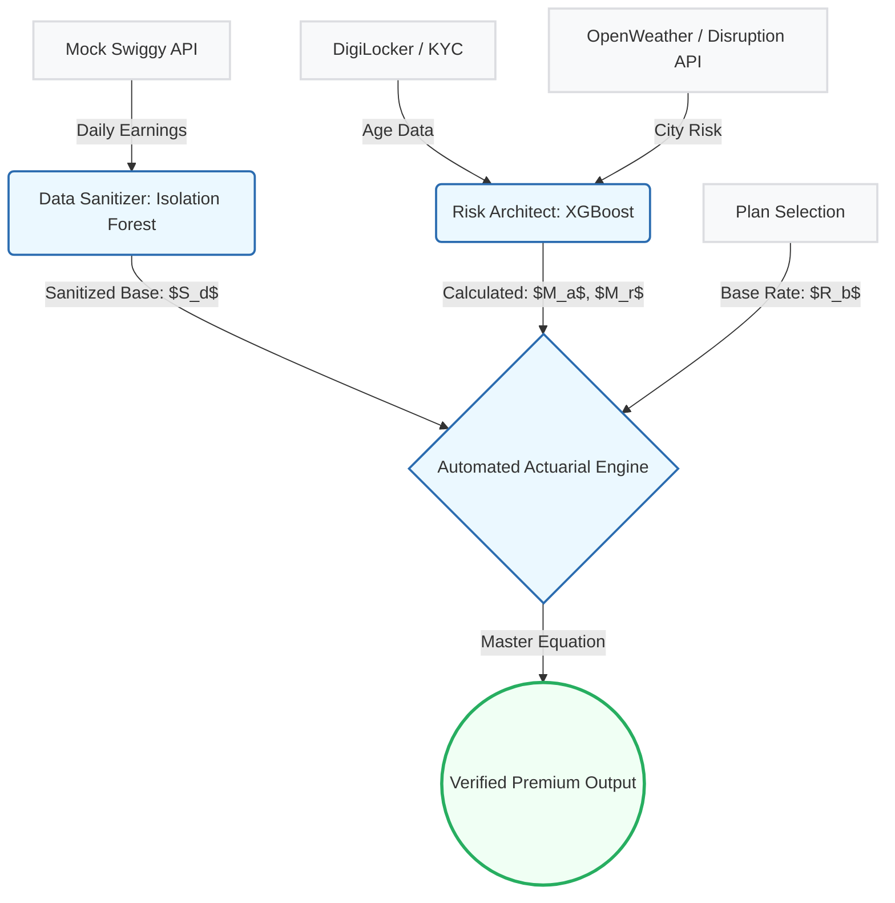

  <!-- Banner -->
  

   

  
<em>An automated, data-driven insurance ecosystem designed to protect India's 12-million-strong gig workforce.</em>

---

  <strong style="font-family: 'Courier New', monospace; font-weight: 800;">CORE DIRECTIVE</strong>

<blockquote style="font-family: 'Segoe UI', Roboto, 'Helvetica Neue', sans-serif; font-size: 1.05em; border-left: 4px solid #34495e; padding-left: 10px;">
By moving away from traditional indemnity insurance and adopting a <strong>Parametric Trigger</strong> model, Haven ensures that delivery partners and gig workers receive instant financial support when environmental disasters or social disruptions prevent them from earning.
</blockquote>

 

<!-- ───────────────────── TABLE OF CONTENTS ───────────────────── -->

<strong>📑 Table of Contents</strong>

 

| # | Section | Description |
|:---:|:---|:---|
| Ⅰ | [The Problem & Persona Scenarios](#i-the-problem--persona-scenarios) | The income-gap crisis facing gig workers |
| Ⅱ | [Demo](#ii-demo) | Live product demonstration |
| Ⅲ | [End-to-End User Workflow (Onboarding)](#iii-end-to-end-user-workflow-onboarding) | Step-by-step onboarding journey |
| Ⅳ | [Premium Plans](#iv-premium-plans) | Tiered pricing — Economy, Value & Elite |
| Ⅴ | [Platform Choices Justification](#v-platform-choices-justification) | Why native mobile + web portal |
| Ⅵ | [Parametric Triggers](#vi-parametric-triggers) | Event-based automated payout logic |
| Ⅶ | [AI/ML Integration](#vii-aiml-integration) | XGBoost pricing & dynamic risk models |
| Ⅷ | [Adversarial Defence & Anti-Spoofing](#viii-adversarial-defence--anti-spoofing) | System resilience against manipulation |
| Ⅸ | [Fraud Detection](#ix-fraud-detection) | Isolation Forest anomaly detection |
| Ⅹ | [Technology Stack](#x-technology-stack) | Full-stack architecture overview |
| Ⅺ | [Development Plan](#xi-development-plan) | Roadmap & milestones |

---

<h3 id="i-the-problem--persona-scenarios" style="font-family: Verdana, Geneva, sans-serif; font-weight: 600; letter-spacing: 1px;">I. THE PROBLEM & PERSONA SCENARIOS</h3>

<strong style="font-family: 'Courier New', monospace; font-size: 1.1em; color: #2c3e50; font-weight: 800;">THE "INCOME GAP" REALITY</strong>

Traditional insurance requires physical damage and long claim cycles. For a gig worker, "damage" isn't just a broken bike; it is a 6-hour rainstorm or a local strike that makes the road inaccessible.

<blockquote><strong>"NO WORK = NO PAY"</strong> — If they don't ride, they don't eat.</blockquote>

<strong style="font-family: 'Courier New', monospace; font-size: 1.1em; color: #2c3e50; font-weight: 800;">SCENARIO A: THE HIGH-INTENSITY PROFESSIONAL</strong>
<ul style="margin-top: 5px; line-height: 1.6; color: #34495e;">
  <li><strong>Target Persona:</strong> Rajesh, 34 (Full-time delivery partner, Chennai — High-Risk Zone). Rajesh works 6 days a week to support his family; if he misses a day on the road, he misses a day of critical pay.</li>
  <li><strong>Trigger Event:</strong> A severe, unseasonal cyclone hits the coast, causing sudden and deep waterlogging across his primary operating zone. It becomes physically impossible to complete deliveries safely for over 8 hours.</li>
  <li><strong>Resolution:</strong> Rajesh is actively enrolled in <strong>Plan 3 (Elite)</strong>. Because Haven's parametric API autonomously detects the severe weather lockdown passing the 6-hour threshold, it instantly authorizes a payout. By the evening, a <strong>100% replacement of his average daily income</strong> is deposited directly into his bank account. Zero claim forms, zero phone calls, zero financial stress.</li>
</ul>

 

<strong style="font-family: 'Courier New', monospace; font-size: 1.1em; color: #2c3e50; font-weight: 800;">SCENARIO B: THE SUPPLEMENTAL EARNER</strong>
<ul style="margin-top: 5px; line-height: 1.6; color: #34495e;">
  <li><strong>Target Persona:</strong> Anjali, 22 (University student working part-time, Indore — Medium-Risk Zone). Anjali rides just 3 days a week to supplement her tuition fees and relies on those specific shifts.</li>
  <li><strong>Trigger Event:</strong> An unexpected local political protest breaks out near the city center, blocking major commercial logistics hubs for the entire afternoon and resulting in a sudden city-wide lockdown for gig transit.</li>
  <li><strong>Resolution:</strong> Anjali is protected by <strong>Plan 1 (Economy)</strong>. Her app dashboard immediately flags her zone with a "Disrupted" status. Once the 6-hour commercial lockdown is officially met, she seamlessly receives <strong>70% of her anticipated daily earnings</strong> without ever interacting with a human agent, effortlessly covering the shift she lost.</li>
</ul>

---

<h3 id="ii-demo" style="font-family: Verdana, Geneva, sans-serif; font-weight: 600; letter-spacing: 1px;">II. DEMO</h3>

(Demo video / link coming soon)

---

<h3 id="iii-end-to-end-user-workflow-onboarding" style="font-family: Verdana, Geneva, sans-serif; font-weight: 600; letter-spacing: 1px;">III. END-TO-END USER WORKFLOW (ONBOARDING)</h3>

  

 

---

<h3 id="iv-premium-plans" style="font-family: Verdana, Geneva, sans-serif; font-weight: 600; letter-spacing: 1px;">IV. PREMIUM PLANS</h3>

<strong style="font-family: 'Courier New', monospace; font-size: 1.1em; color: #2c3e50; font-weight: 800;">PLAN 1: ECONOMY (SAFETY NET)</strong>
<ul style="margin-top: 8px; margin-bottom: 16px; font-size: 0.95em; padding-left: 20px; line-height: 1.6;">
  <li>Budget-conscious workers seeking a low-cost entry point for basic protection.</li>
  <li><strong>70%</strong> of your average daily income replacement.</li>
  <li><strong>2 weeks</strong> standard activation period.</li>
</ul>

| Age Band | Avg Daily Salary | Base Rate | Risk Zone | Weekly Premium | Daily Payout | Waiting Time |
| :---: | :---: | :---: | :---: | :---: | :---: | :---: |
| 20 - 25 | ₹600 | 7% | Low | ₹42 | ₹420 | 2 Weeks |
| 20 - 25 | ₹600 | 7% | Mid | ₹46 | ₹420 | 2 Weeks |
| 20 - 25 | ₹600 | 7% | High | ₹50 | ₹420 | 2 Weeks |
| 26 - 40 | ₹900 | 7% | Low | ₹76 | ₹630 | 2 Weeks |
| 26 - 40 | ₹900 | 7% | Mid | ₹83 | ₹630 | 2 Weeks |
| 26 - 40 | ₹900 | 7% | High | ₹91 | ₹630 | 2 Weeks |
| 40+ | ₹1,200 | 7% | Low | ₹126 | ₹840 | 2 Weeks |
| 40+ | ₹1,200 | 7% | Mid | ₹139 | ₹840 | 2 Weeks |
| 40+ | ₹1,200 | 7% | High | ₹151 | ₹840 | 2 Weeks |

 

<strong style="font-family: 'Courier New', monospace; font-size: 1.1em; color: #2c3e50; font-weight: 800;">PLAN 2: VALUE (INCOME REPLACEMENT)</strong>
<ul style="margin-top: 8px; margin-bottom: 16px; font-size: 0.95em; padding-left: 20px; line-height: 1.6;">
  <li>Full-time professionals who depend entirely on their gig earnings for their livelihood.</li>
  <li><strong>100%</strong> of your average daily income replacement.</li>
  <li><strong>4 weeks</strong> standard activation period.</li>
</ul>

| Age Band | Avg Daily Salary | Base Rate | Risk Zone | Weekly Premium | Daily Payout | Waiting Time |
| :---: | :---: | :---: | :---: | :---: | :---: | :---: |
| 20 - 25 | ₹600 | 10% | Low | ₹60 | ₹600 | 4 Weeks |
| 20 - 25 | ₹600 | 10% | Mid | ₹66 | ₹600 | 4 Weeks |
| 20 - 25 | ₹600 | 10% | High | ₹72 | ₹600 | 4 Weeks |
| 26 - 40 | ₹900 | 10% | Low | ₹108 | ₹900 | 4 Weeks |
| 26 - 40 | ₹900 | 10% | Mid | ₹119 | ₹900 | 4 Weeks |
| 26 - 40 | ₹900 | 10% | High | ₹130 | ₹900 | 4 Weeks |
| 40+ | ₹1,200 | 10% | Low | ₹180 | ₹1,200 | 4 Weeks |
| 40+ | ₹1,200 | 10% | Mid | ₹198 | ₹1,200 | 4 Weeks |
| 40+ | ₹1,200 | 10% | High | ₹216 | ₹1,200 | 4 Weeks |

 

<strong style="font-family: 'Courier New', monospace; font-size: 1.1em; color: #2c3e50; font-weight: 800;">PLAN 3: ELITE (IMMEDIATE PROTECTION)</strong>
<ul style="margin-top: 8px; margin-bottom: 16px; font-size: 0.95em; padding-left: 20px; line-height: 1.6;">
  <li>High-intensity workers in volatile or high-risk zones who need immediate financial resilience.</li>
  <li><strong>100%</strong> of your average daily income replacement.</li>
  <li><strong>0 days</strong> (Instant activation the moment you sign the policy).</li>
</ul>

| Age Band | Avg Daily Salary | Base Rate | Risk Zone | Weekly Premium | Daily Payout | Waiting Time |
| :---: | :---: | :---: | :---: | :---: | :---: | :---: |
| 20 - 25 | ₹600 | 20% | Low | ₹120 | ₹600 | 0 Days |
| 20 - 25 | ₹600 | 20% | Mid | ₹132 | ₹600 | 0 Days |
| 20 - 25 | ₹600 | 20% | High | ₹144 | ₹600 | 0 Days |
| 26 - 40 | ₹900 | 20% | Low | ₹216 | ₹900 | 0 Days |
| 26 - 40 | ₹900 | 20% | Mid | ₹238 | ₹900 | 0 Days |
| 26 - 40 | ₹900 | 20% | High | ₹259 | ₹900 | 0 Days |
| 40+ | ₹1,200 | 20% | Low | ₹360 | ₹1,200 | 0 Days |
| 40+ | ₹1,200 | 20% | Mid | ₹396 | ₹1,200 | 0 Days |
| 40+ | ₹1,200 | 20% | High | ₹432 | ₹1,200 | 0 Days |

 

  <strong>Data Source:</strong> All income benchmarks are derived from research findings at <a href="https://www.thefinthusiastic.com/post/india-gig-economy-all-you-need-to-know" style="color: #2980b9;">The Finthusiastic: India's Gig Economy</a>. These data parameters dictate how we calculate the premiums dynamically.

---

<h3 id="v-platform-choices-justification" style="font-family: Verdana, Geneva, sans-serif; font-weight: 600; letter-spacing: 1px;">V. PLATFORM CHOICES JUSTIFICATION</h3>

<strong style="font-family: 'Courier New', monospace; font-size: 1.1em; color: #2c3e50; font-weight: 800;">NATIVE MOBILE (User App)</strong>

The delivery partner's workplace is the road, not a desk. A native mobile application is the only viable interface for this demographic.

<ul>
  <li><strong>Hardware Sensors:</strong> Native GPS is mandatory for "Proof of Presence" to trigger parametric payouts. Local Camera access enables required AI-driven liveness checks to prevent identity fraud.</li>
</ul>

<strong style="font-family: 'Courier New', monospace; font-size: 1.1em; color: #2c3e50; font-weight: 800;">WEB PORTAL (Admin Panel)</strong>
<ul>
  <li><strong>Data Density:</strong> Managing 12 million global profiles requires high-resolution Risk Heatmaps and Recharts analytics—only effective on large desktop displays.</li>
  <li><strong>Actuarial Management:</strong> Adjusting XGBoost weights, reviewing insurance pool solvency, and generating manual trigger overrides demand a secure, high-speed input web environment.</li>
</ul>

---

<h3 id="vi-parametric-triggers" style="font-family: Verdana, Geneva, sans-serif; font-weight: 600; letter-spacing: 1px;">VI. PARAMETRIC TRIGGERS</h3>

<strong style="font-family: 'Courier New', monospace; font-size: 1.1em; color: #2c3e50; font-weight: 800;">
DUAL PARAMETRIC TRIGGER MODEL
</strong>

Haven operates on a strictly defined <strong>Dual Trigger Parametric Model</strong>, where claims are not user-initiated but automatically activated when objective, verifiable conditions are satisfied. 
These triggers are derived from real-time environmental signals and network-level behavioral disruptions, ensuring zero subjectivity and high fraud resistance.

<strong style="font-family: 'Courier New', monospace; font-size: 1.1em; color: #2c3e50; font-weight: 800;">
1. ENVIRONMENTAL TRIGGER (EXTERNAL DISRUPTION SIGNAL)
</strong>

This trigger activates when adverse environmental conditions materially impact delivery operations within a defined geographic cluster.

<ul>
  <li><strong>Data Source:</strong> Real-time Weather APIs + Historical Weather Validation</li>
  <li><strong>Primary Condition:</strong> Rainfall intensity ≥ 2.5 mm/hr OR severe AQI thresholds</li>
  <li><strong>Geo-Scope:</strong> Worker's live GPS coordinates mapped to city grid</li>
</ul>

<strong>Multi-Layer Validation (from system architecture):</strong>

<ul>
  <li><strong>Track B (Live Weather Engine):</strong>
    <ul>
      <li>Continuously ingests real-time weather signals</li>
      <li>Generates initial disruption confidence (+0 to +15)</li>
    </ul>
  </li>

  <li><strong>Track E (Historical Weather Engine):</strong>
    <ul>
      <li>Validates rainfall consistency using historical datasets</li>
      <li>Acts as <strong>Final Verdict Signal</strong> (+0 to +50)</li>
    </ul>
  </li>
</ul>

<strong>Trigger Condition:</strong>  
Environmental trigger is considered <strong>ACTIVE</strong> when:

Weather_Severity ≥ Threshold  AND  Historical_Validation = TRUE

This ensures that transient API spikes or false weather readings do not trigger payouts.

<strong style="font-family: 'Courier New', monospace; font-size: 1.1em; color: #2c3e50; font-weight: 800;">
2. BEHAVIORAL TRIGGER (NETWORK DISRUPTION SIGNAL)
</strong>

This trigger activates when platform-level inefficiencies indicate systemic disruption affecting multiple workers simultaneously.

<ul>
  <li><strong>Core Signals:</strong>
    <ul>
      <li>Prolonged waiting time (idle state while online)</li>
      <li>Delivery delays across multiple workers</li>
    </ul>
  </li>
</ul>

<strong>Multi-Track + ML Validation:</strong>

<ul>
  <li><strong>Track C (Peer Corroboration Engine):</strong>
    <ul>
      <li>Analyzes workers within a 2 km radius</li>
      <li>Computes disruption ratio (affected vs active workers)</li>
      <li>Validates network-wide consistency (+0 to +25)</li>
    </ul>
  </li>

  <li><strong>Track D (Baseline Income Engine):</strong>
    <ul>
      <li>Compares current earnings vs 3-week historical baseline</li>
      <li>Detects abnormal drop in hourly income</li>
      <li>Estimates financial impact (+0 to +10)</li>
    </ul>
  </li>

  <li><strong>ML Scoring Layer:</strong>
    <ul>
      <li>Aggregates behavioral anomalies into a disruption probability score</li>
      <li>Filters noise using learned patterns of normal vs disrupted demand cycles</li>
    </ul>
  </li>
</ul>

<strong>Trigger Condition:</strong>

(Avg_Wait_Time ↑ AND Multi_User_Delay = TRUE)  
AND  
Disruption_Ratio ≥ Critical_Threshold

This ensures that individual inefficiencies do not trigger claims—only systemic failures do.

<strong style="font-family: 'Courier New', monospace; font-size: 1.1em; color: #2c3e50; font-weight: 800;">
3. TRIGGER SYNCHRONIZATION LOGIC
</strong>

A claim is activated only when both triggers align within a temporal window, ensuring causality between environmental conditions and economic disruption.

FINAL TRIGGER = ENVIRONMENTAL_TRIGGER ∩ BEHAVIORAL_TRIGGER

<ul>
  <li>Prevents false positives from isolated weather or platform noise</li>
  <li>Ensures high-confidence parametric payouts</li>
  <li>Feeds directly into the Confidence Aggregation Engine (0–100 scoring)</li>
</ul>

<strong style="font-family: 'Courier New', monospace; font-size: 1.1em; color: #2c3e50; font-weight: 800;">
4. FRAUD GUARDRAIL (HARD VETO LAYER)
</strong>

<ul>
  <li>GPS spoof detection</li>
  <li>Device fingerprint validation</li>
  <li>Blacklist checks</li>
</ul>

<strong>Override Rule:</strong>

Fraud_Flag = TRUE → Trigger Invalidated (Hard Veto)

This ensures that even if both triggers are satisfied, fraudulent sessions are terminated before payout execution.

---

<h3 id="vii-aiml-integration" style="font-family: Verdana, Geneva, sans-serif; font-weight: 600; letter-spacing: 1px;">VII. AI/ML INTEGRATION</h3>

**AI-DRIVEN PREMIUM CALCULATION**  
The core of Haven's financial logic is the Automated Actuarial Engine. Unlike traditional "flat-rate" insurance, Haven calculates a personalized weekly premium by analyzing a worker's specific earning power and environmental risk in real-time.

 

#### 1. TERMINOLOGY & DEFINITIONS
To ensure mathematical transparency, we define the variables that drive our engine:

| Variable | Symbol | Definition |
| :--- | :---: | :--- |
| **Avg Daily Salary** | $S_d$ | A 30-day weighted moving average of the worker's earnings, fetched via the Mock Swiggy API. It establishes the baseline income that needs protection. |
| **Base Rate** | $R_b$ | The primary percentage assigned based on the user's chosen plan: Economy (Plan 1): **7%** Value (Plan 2): **10%** Elite (Plan 3): **20%** |
| **Risk Multiplier** | $M_r$ | A dynamic weight (`1.0x` to `1.2x`) predicted by our ML model based on the historical disruption frequency of the worker's primary operating city. |
| **Age Multiplier** | $M_a$ | An actuarial weight (`1.0x` to `1.5x`) reflecting risk exposure data correlated with the worker's age bracket (20-25, 26-40, 40+). |

 

#### 2. THE MASTER EQUATION
Every premium is custom-generated at the start of the 7-day billing cycle using the following formula:

> [!IMPORTANT]
> **Weekly Premium Calculation:**
> $$ \text{Weekly Premium} = S_d \times R_b \times M_r \times M_a $$

> ### 🧮 Mathematical Walkthrough Example
> **Persona:** A 28-year-old rider in a "High Risk" zone like Chennai ($M_a = 1.2$, $M_r = 1.2$) earning an average of ₹900/day, who selects the Value Plan ($R_b = 10\%$).
> 
> $$ \text{Calculation: }  900 \times 0.10 \times 1.2 \times 1.2 = \mathbf{₹129.60 \text{ / week}} $$
> 
> *This ensures that pricing is mathematically "fair"—workers in safer zones do not subsidize the higher risk of those in volatile metros.*

 

#### 3. THE MACHINE LEARNING ARCHITECTURE
We deploy a two-stage predictive pipeline to ensure the inputs are sanitized (free of fraud) and architected (fairly weighted).

##### A. Isolation Forest (The Data Sanitizer)

**Role**  
Unsupervised Anomaly Detection for Income Integrity. In decentralized gig work, "Income Inflation" is a structural risk where users might attempt to fake high-value transactions to secure higher insurance payouts. Isolation Forest is our first line of defense, identifying these "Pump and Dump" schemes by explicitly isolating anomalies.

**Implementation**  
We represent each user's income profile as a feature vector $\mathbf{x} \in \mathbb{R}^4$:
$$ \mathbf{x} = [\text{Daily Earnings}, \text{Order Count}, \text{Avg Order Value}, \text{Peak Frequency}] $$

**Mathematical Logic**  
The model builds an ensemble of $i$Trees. Because fraudulent "spikes" are few and different, they are isolated in very few splits, resulting in a short Path Length $h(x)$. We calculate the score $s(x, n)$ to determine if the income data is "truthful":

> [!TIP]
> **Anomaly Scoring Logic:**
> $$ s(x, n) = 2^{-\frac{E(h(x))}{c(n)}} $$
> **Outcome:** If $s \to 1$ (High Anomaly), the system ignores the reported $S_d$ and normalizes it to the 90th Percentile Median for that worker's city tier, protecting the insurance pool's liquidity.

 

##### B. XGBoost Regression (The Risk Architect)

**Role**  
Supervised Non-Linear Risk Scoring. Once the data is sanitized, XGBoost calculates the specific Risk ($M_r$) and Age ($M_a$) multipliers. We use XGBoost because the relationship between age, city density, and risk is non-linear.

**Implementation**  
Even without a finalized live training set, the model is architected to minimize a Regularized Objective Function, ensuring premiums remain stable across diverse urban clusters.

**Mathematical Logic**  
$$ \mathcal{L}(\phi) = \sum_i l(\hat{y}_i, y_i) + \sum_k \Omega(f_k) $$

The model builds additive trees sequentially, where each new tree corrects the "residual errors" of previous trees using a second-order Taylor expansion for high-precision convergence. We apply $L_1/L_2$ regularization ($\Omega$) to prevent the model from "overfitting" to a single freak weather event. 
**Outcome:** The final leaves of the trees provide the precise numerical weights fed directly into our master formula.

 

#### 4. AUTOMATED PIPELINE FLOWCHART

---

<h3 id="viii-adversarial-defence--anti-spoofing" style="font-family: Verdana, Geneva, sans-serif; font-weight: 600; letter-spacing: 1px;">VIII. ADVERSARIAL DEFENCE & ANTI-SPOOFING</h3>

(Architecture pending)

---

<h3 id="ix-fraud-detection" style="font-family: Verdana, Geneva, sans-serif; font-weight: 600; letter-spacing: 1px;">IX. FRAUD DETECTION</h3>

(System architecture pending)

---

<h3 id="x-technology-stack" style="font-family: Verdana, Geneva, sans-serif; font-weight: 600; letter-spacing: 1px;">X. TECHNOLOGY STACK</h3>

<strong style="font-family: 'Courier New', monospace; font-size: 1.1em; color: #2c3e50; font-weight: 800;">USER APP (Client Interface)</strong>

| Category | Technology |
| :--- | :--- |
| **Framework** | React Native 0.74 (Expo SDK 51) |
| **Language** | TypeScript |
| **State** | Zustand 4.x |
| **Navigation** | Expo Router v3 |
| **Identity/Security** | Expo Camera & Biometrics |
| **Communication** | Firebase FCM & Expo Notifications |
| **UI/UX** | Lottie & Reanimated |

<strong style="font-family: 'Courier New', monospace; font-size: 1.1em; color: #2c3e50; font-weight: 800;">ADMIN PANEL (Actuarial Portal)</strong>

| Category | Technology |
| :--- | :--- |
| **Framework** | Next.js 14 (App Router) |
| **Styling** | Tailwind CSS & shadcn/ui |
| **Data Fetching** | TanStack Query v5 |
| **Analytics** | Recharts |
| **Auth** | NestJS Admin JWT |
| **Hosting** | Firebase Hosting |

<strong style="font-family: 'Courier New', monospace; font-size: 1.1em; color: #2c3e50; font-weight: 800;">BACKEND ENGINE</strong>

| Category | Technology |
| :--- | :--- |
| **Runtime** | Node.js 20 LTS (NestJS 10) |
| **Database** | Supabase (PostgreSQL) |
| **Scheduler** | @nestjs/schedule (CRON) |
| **External APIs** | OpenWeatherMap & WAQI |
| **CI/CD** | GitHub Actions & Railway |
| **Validation** | Zod |

---

<h3 id="xi-development-plan" style="font-family: Verdana, Geneva, sans-serif; font-weight: 600; letter-spacing: 1px;">XI. DEVELOPMENT PLAN</h3>

(Roadmap & milestones pending)

