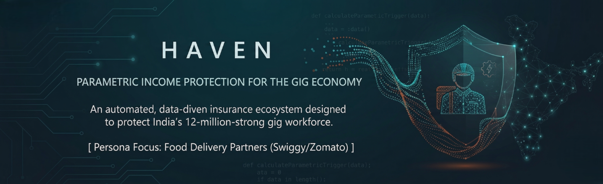
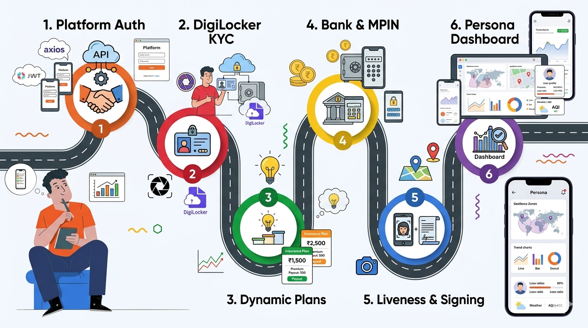
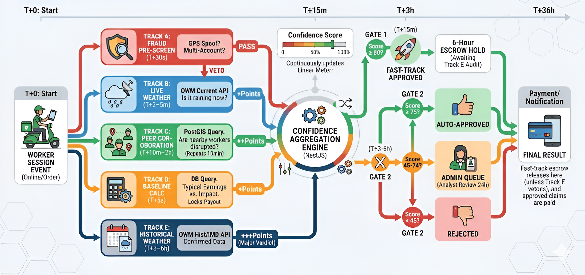
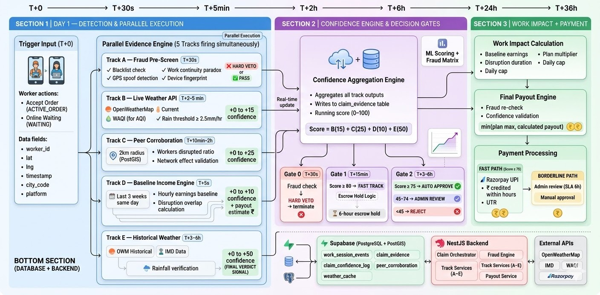
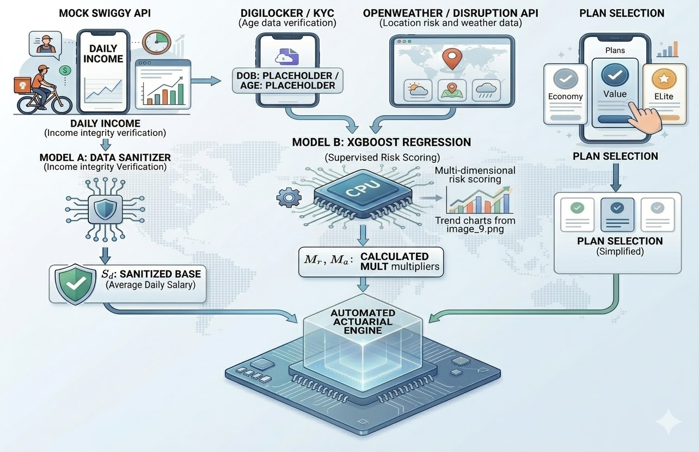

  <!-- Banner -->
  

   

  
<em>An automated, data-driven insurance ecosystem designed to protect India's 12-million-strong gig workforce.</em>

---

  <strong style="font-family: 'Courier New', monospace; font-weight: 800;">CORE DIRECTIVE</strong>

<blockquote style="font-family: 'Segoe UI', Roboto, 'Helvetica Neue', sans-serif; font-size: 1.05em; border-left: 4px solid #34495e; padding-left: 10px;">
By moving away from traditional indemnity insurance and adopting a <strong>Parametric Trigger</strong> model, Haven ensures that delivery partners and gig workers receive instant financial support when environmental disasters or social disruptions prevent them from earning.
</blockquote>

 

<!-- ───────────────────── TABLE OF CONTENTS ───────────────────── -->

<strong>📑 Table of Contents</strong>

 

| # | Section | Description |
|:---:|:---|:---|
| Ⅰ | [The Problem & Persona Scenarios](#i-the-problem--persona-scenarios) | The income-gap crisis facing gig workers |
| Ⅱ | [Demo](#ii-demo) | Live product demonstration |
| Ⅲ | [End-to-End User Workflow (Onboarding)](#iii-end-to-end-user-workflow-onboarding) | Step-by-step onboarding journey |
| Ⅳ | [Premium Plans](#iv-premium-plans) | Tiered pricing — Economy, Value & Elite |
| Ⅴ | [Platform Choices Justification](#v-platform-choices-justification) | Why native mobile + web portal |
| Ⅵ | [Parametric Triggers](#vi-parametric-triggers) | Event-based automated payout logic |
| Ⅶ | [AI/ML Integration](#vii-aiml-integration) | XGBoost pricing & dynamic risk models |
| Ⅷ | [Adversarial Defence & Anti-Spoofing](#viii-adversarial-defence--anti-spoofing) | System resilience against manipulation |
| Ⅸ | [Fraud Detection](#ix-fraud-detection) | Isolation Forest anomaly detection |
| Ⅹ | [Technology Stack](#x-technology-stack) | Full-stack architecture overview |
| Ⅺ | [Development Plan](#xi-development-plan) | Roadmap & milestones |

---

<h3 id="i-the-problem--persona-scenarios" style="font-family: Verdana, Geneva, sans-serif; font-weight: 600; letter-spacing: 1px;">I. THE PROBLEM & PERSONA SCENARIOS</h3>

<strong style="font-family: 'Courier New', monospace; font-size: 1.1em; color: #2c3e50; font-weight: 800;">THE "INCOME GAP" REALITY</strong>

India's gig delivery workforce — over <strong>12 million</strong> independent contractors working for Swiggy, Zomato, Zepto, and similar platforms — operates without <em>any</em> employer safety net. They earn between <strong>₹8,000 – ₹25,000/month</strong> depending on hours and city, ride petrol bikes, electric scooters, or bicycles, and have UPI-linked bank accounts via PhonePe, Google Pay, or Paytm.

Traditional insurance requires physical damage, claim filing, adjuster visits, and weeks of waiting. But for a gig worker, "damage" isn't a broken bike — it's a <strong>6-hour rainstorm</strong> that floods the roads, a <strong>hazardous AQI day</strong> in Delhi that makes breathing dangerous, a <strong>2-hour platform outage</strong> during peak dinner rush, or a <strong>state-imposed curfew</strong> that shuts down all movement.

<blockquote><strong>"NO WORK = NO PAY"</strong> — If they don't ride, they don't eat. There is no sick leave, no employer compensation, no fallback.</blockquote>

 

<strong style="font-family: 'Courier New', monospace; font-size: 1.1em; color: #2c3e50; font-weight: 800;">PERSONA SCENARIOS</strong>

<strong>SCENARIO A — RAIN_EXTREME: Rajesh, 34 · Chennai · Full-time · Pro Plan</strong>

 
<ul>
  <li><strong>Who:</strong> Rajesh is a full-time Swiggy delivery partner in Chennai, a Tier-1 city in the cyclone belt (City Risk Index: 1.28). He works 55+ hours/week on a petrol bike and earns ~₹900/day.</li>
  <li><strong>Event:</strong> Cyclone Michaung makes landfall. Cumulative rainfall crosses <strong>64.5mm in 24 hours</strong> across his delivery zone. Roads are waterlogged for 8+ hours.</li>
  <li><strong>What happens:</strong> Haven's weather CRON detects the threshold breach via OWM + IMD cross-verification at Rajesh's GPS coordinates. A <code>RAIN_EXTREME</code> trigger event is created automatically. The 36-hour pipeline fires: Track A fraud pre-screen passes in 12 seconds, Track B live weather confirms active rainfall (code 502), Track C finds that <strong>78% of nearby workers</strong> within 2km also went offline. By T+15 minutes, confidence score hits <strong>87/100</strong> → Gate 1 fires a fast-track escrow hold.</li>
  <li><strong>Resolution:</strong> Track E historical weather confirms 94mm rainfall at station-level accuracy by T+4 hours. Escrow releases. Rajesh receives <strong>₹900 (100% daily income)</strong> via UPI by evening. No forms. No calls. No waiting.</li>
</ul>

<strong>SCENARIO B — AQI_SEVERE: Vikram, 28 · Delhi · Full-time · Economy Plan</strong>

 
<ul>
  <li><strong>Who:</strong> Vikram delivers for Zomato in North Delhi during the November–January smog season. He works 40 hours/week on an electric scooter. Delhi has the highest AQI risk in India (CRI: 1.25).</li>
  <li><strong>Event:</strong> AQI crosses <strong>300</strong> at 8 AM and stays above the hazardous threshold for <strong>6 consecutive hours</strong>. The CPCB station nearest to Vikram's route confirms sustained severe air quality.</li>
  <li><strong>What happens:</strong> Haven's AQI monitoring via WAQI.info detects the 4-hour sustained breach. The system waits for the required duration, then fires a <code>AQI_SEVERE</code> trigger. Peer corroboration shows <strong>62% of nearby workers</strong> reduced activity or went offline.</li>
  <li><strong>Resolution:</strong> Vikram receives <strong>70% of his average daily earnings</strong> (Economy plan coverage) deposited to his PhonePe UPI by the next morning.</li>
</ul>

<strong>SCENARIO C — HEAT_EXTREME: Lakshmi, 40 · Hyderabad · Part-time · Lite Plan</strong>

 
<ul>
  <li><strong>Who:</strong> Lakshmi is a part-time delivery partner, working afternoon shifts on a bicycle. She earns ~₹400/day and enrolled in the Lite plan for basic coverage.</li>
  <li><strong>Event:</strong> Hyderabad records <strong>46°C for two consecutive days</strong> in May. The IMD issues an official heat alert advisory. Outdoor work becomes genuinely dangerous.</li>
  <li><strong>What happens:</strong> Haven confirms the consecutive-day threshold via OWM and IMD heat advisories. Track D baseline calculation compares her earnings to the same days in prior weeks, confirming she would have been actively working.</li>
  <li><strong>Resolution:</strong> Lakshmi receives <strong>₹280</strong> (70% of her ₹400 daily baseline), covering the lost shift that heat made unsafe.</li>
</ul>

<strong>SCENARIO D — PLATFORM_OUTAGE: Arjun, 25 · Mumbai · Full-time · Pro Plan</strong>

 
<ul>
  <li><strong>Who:</strong> Arjun is a top-rated Swiggy partner in Mumbai, working peak dinner hours (6 PM–10 PM) when earnings are highest. He earns ~₹1,200/day.</li>
  <li><strong>Event:</strong> The Swiggy platform goes down at <strong>7:15 PM</strong>. Haven's HTTP probes to three Swiggy data centers (Mumbai, Chennai, Delhi) all return failures simultaneously. The outage lasts <strong>2 hours 40 minutes</strong> during the defined peak window.</li>
  <li><strong>What happens:</strong> All three DC probes must fail (to eliminate regional network issues vs. genuine outage). After the 120-minute threshold, a <code>PLATFORM_OUTAGE</code> trigger fires. Track C peer corroboration is naturally 100% — every worker on the platform was affected.</li>
  <li><strong>Resolution:</strong> Arjun receives <strong>₹1,200 (100% daily income)</strong> by next morning. The platform being down is the proof — no worker testimony needed.</li>
</ul>

<strong>SCENARIO E — SOCIAL_DISRUPTION: Anjali, 22 · Indore · Part-time · Economy Plan</strong>

 
<ul>
  <li><strong>Who:</strong> Anjali is a college student working part-time shifts in Indore (Medium-Risk Zone). She uses her gig earnings to pay for tuition.</li>
  <li><strong>Event:</strong> A state <em>bandh</em> (general strike) is declared. Roads are blocked, and a government-imposed movement restriction lasts <strong>8 hours</strong>. The PIB (Press Information Bureau) confirms the announcement.</li>
  <li><strong>What happens:</strong> Unlike weather triggers, <code>SOCIAL_DISRUPTION</code> cannot be fully automated — it requires human verification. A Haven admin confirms the government announcement and fires a manual trigger from the admin panel. Claims are created for all eligible policies in the affected city within 3–8 seconds.</li>
  <li><strong>Resolution:</strong> Anjali's dashboard shows her zone as "Disrupted." She receives <strong>70% of her average daily earnings</strong>, covering the lost shift.</li>
</ul>

 

<strong style="font-family: 'Courier New', monospace; font-size: 1.1em; color: #2c3e50; font-weight: 800;">PARAMETRIC vs TRADITIONAL — WHY IT MATTERS</strong>

| | Traditional Insurance | Haven (Parametric) |
|:---|:---:|:---:|
| **Claim Filing** | Manual forms & documentation | ❌ None — automatic |
| **Proof Required** | Worker testimony, photos, adjuster | Sensor data IS the proof |
| **Processing Time** | Weeks to months | **2–36 hours** |
| **Decision Basis** | Subjective damage assessment | Objective threshold breach |
| **Fraud Vector** | Fake/exaggerated damage | Must spoof GPS + weather + peers |
| **Worker Action** | Multiple touchpoints required | Zero — just stay enrolled |

---

<h3 id="ii-demo" style="font-family: Verdana, Geneva, sans-serif; font-weight: 600; letter-spacing: 1px;">II. DEMO</h3>

(Demo video / link coming soon)

---

<h3 id="iii-end-to-end-user-workflow-onboarding" style="font-family: Verdana, Geneva, sans-serif; font-weight: 600; letter-spacing: 1px;">III. END-TO-END USER WORKFLOW (ONBOARDING)</h3>

  <strong style="font-family: 'Courier New', monospace; font-size: 1.1em; color: #2c3e50; font-weight: 800;">1. USER ONBOARDING & APP EXPERIENCE</strong> 
  
Mobile interface screens: Digital KYC, Plan Selection, and Policy Dashboard.

  
  
      
  
  <strong style="font-family: 'Courier New', monospace; font-size: 1.1em; color: #2c3e50; font-weight: 800;">2. FULL SYSTEM ARCHITECTURE FLOW</strong> 
  
Complete end-to-end data lifecycle from trigger event to automated payout.

  

 

---

<h3 id="iv-premium-plans" style="font-family: Verdana, Geneva, sans-serif; font-weight: 600; letter-spacing: 1px;">IV. PREMIUM PLANS</h3>

<strong style="font-family: 'Courier New', monospace; font-size: 1.1em; color: #2c3e50; font-weight: 800;">PLAN 1: ECONOMY (SAFETY NET)</strong>
<ul style="margin-top: 8px; margin-bottom: 16px; font-size: 0.95em; padding-left: 20px; line-height: 1.6;">
  <li>Budget-conscious workers seeking a low-cost entry point for basic protection.</li>
  <li><strong>70%</strong> of your average daily income replacement.</li>
  <li><strong>2 weeks</strong> standard activation period.</li>
</ul>

| Age Band | Avg Daily Salary | Base Rate | Risk Zone | Weekly Premium | Daily Payout | Waiting Time |
| :---: | :---: | :---: | :---: | :---: | :---: | :---: |
| 20 - 25 | ₹600 | 7% | Low | ₹42 | ₹420 | 2 Weeks |
| 20 - 25 | ₹600 | 7% | Mid | ₹46 | ₹420 | 2 Weeks |
| 20 - 25 | ₹600 | 7% | High | ₹50 | ₹420 | 2 Weeks |
| 26 - 40 | ₹900 | 7% | Low | ₹76 | ₹630 | 2 Weeks |
| 26 - 40 | ₹900 | 7% | Mid | ₹83 | ₹630 | 2 Weeks |
| 26 - 40 | ₹900 | 7% | High | ₹91 | ₹630 | 2 Weeks |
| 40+ | ₹1,200 | 7% | Low | ₹126 | ₹840 | 2 Weeks |
| 40+ | ₹1,200 | 7% | Mid | ₹139 | ₹840 | 2 Weeks |
| 40+ | ₹1,200 | 7% | High | ₹151 | ₹840 | 2 Weeks |

 

<strong style="font-family: 'Courier New', monospace; font-size: 1.1em; color: #2c3e50; font-weight: 800;">PLAN 2: VALUE (INCOME REPLACEMENT)</strong>
<ul style="margin-top: 8px; margin-bottom: 16px; font-size: 0.95em; padding-left: 20px; line-height: 1.6;">
  <li>Full-time professionals who depend entirely on their gig earnings for their livelihood.</li>
  <li><strong>100%</strong> of your average daily income replacement.</li>
  <li><strong>4 weeks</strong> standard activation period.</li>
</ul>

| Age Band | Avg Daily Salary | Base Rate | Risk Zone | Weekly Premium | Daily Payout | Waiting Time |
| :---: | :---: | :---: | :---: | :---: | :---: | :---: |
| 20 - 25 | ₹600 | 10% | Low | ₹60 | ₹600 | 4 Weeks |
| 20 - 25 | ₹600 | 10% | Mid | ₹66 | ₹600 | 4 Weeks |
| 20 - 25 | ₹600 | 10% | High | ₹72 | ₹600 | 4 Weeks |
| 26 - 40 | ₹900 | 10% | Low | ₹108 | ₹900 | 4 Weeks |
| 26 - 40 | ₹900 | 10% | Mid | ₹119 | ₹900 | 4 Weeks |
| 26 - 40 | ₹900 | 10% | High | ₹130 | ₹900 | 4 Weeks |
| 40+ | ₹1,200 | 10% | Low | ₹180 | ₹1,200 | 4 Weeks |
| 40+ | ₹1,200 | 10% | Mid | ₹198 | ₹1,200 | 4 Weeks |
| 40+ | ₹1,200 | 10% | High | ₹216 | ₹1,200 | 4 Weeks |

 

<strong style="font-family: 'Courier New', monospace; font-size: 1.1em; color: #2c3e50; font-weight: 800;">PLAN 3: ELITE (IMMEDIATE PROTECTION)</strong>
<ul style="margin-top: 8px; margin-bottom: 16px; font-size: 0.95em; padding-left: 20px; line-height: 1.6;">
  <li>High-intensity workers in volatile or high-risk zones who need immediate financial resilience.</li>
  <li><strong>100%</strong> of your average daily income replacement.</li>
  <li><strong>0 days</strong> (Instant activation the moment you sign the policy).</li>
</ul>

| Age Band | Avg Daily Salary | Base Rate | Risk Zone | Weekly Premium | Daily Payout | Waiting Time |
| :---: | :---: | :---: | :---: | :---: | :---: | :---: |
| 20 - 25 | ₹600 | 20% | Low | ₹120 | ₹600 | 0 Days |
| 20 - 25 | ₹600 | 20% | Mid | ₹132 | ₹600 | 0 Days |
| 20 - 25 | ₹600 | 20% | High | ₹144 | ₹600 | 0 Days |
| 26 - 40 | ₹900 | 20% | Low | ₹216 | ₹900 | 0 Days |
| 26 - 40 | ₹900 | 20% | Mid | ₹238 | ₹900 | 0 Days |
| 26 - 40 | ₹900 | 20% | High | ₹259 | ₹900 | 0 Days |
| 40+ | ₹1,200 | 20% | Low | ₹360 | ₹1,200 | 0 Days |
| 40+ | ₹1,200 | 20% | Mid | ₹396 | ₹1,200 | 0 Days |
| 40+ | ₹1,200 | 20% | High | ₹432 | ₹1,200 | 0 Days |

 

  <strong>Data Source:</strong> All income benchmarks are derived from research findings at <a href="https://www.thefinthusiastic.com/post/india-gig-economy-all-you-need-to-know" style="color: #2980b9;">The Finthusiastic: India's Gig Economy</a>. These data parameters dictate how we calculate the premiums dynamically.

---

<h3 id="v-platform-choices-justification" style="font-family: Verdana, Geneva, sans-serif; font-weight: 600; letter-spacing: 1px;">V. PLATFORM CHOICES JUSTIFICATION</h3>

In designing a financial product for a 12-million-strong workforce, tech debt translates directly into operational failure. Here is exactly why we chose our tech stack.

 

<strong style="font-family: 'Courier New', monospace; font-size: 1.1em; color: #3178C6; font-weight: 800; cursor: pointer;">1. THE MOBILE APPS: REACT NATIVE (EXPO)</strong>

<ul style="margin-top: 5px; margin-bottom: 20px;">
  <li>✅ <strong>Why we chose it:</strong> The delivery partner's workplace is the road. Expo's EAS Build allowed us to compile cloud APKs instantly without local Android Studio overhead. The ecosystem specifically supports critical Indian compliance libraries like <code>react-native-signature-canvas</code> (required for IRDAI legal digital signatures).</li>
  <li>❌ <strong>What we rejected & why:</strong> <em>Flutter</em>. While performant, its ecosystem for specific digital signature and form-validation libraries isn't as robust as React Native's for our specific regulatory needs.</li>
  <li style="font-size: 0.9em; list-style-type: none; margin-top: 5px;">🔗 <strong>Proof & Research:</strong> <a href="https://docs.expo.dev/build/introduction/">Expo EAS Build Specs</a> | <a href="https://github.com/YanYuanFE/react-native-signature-canvas">RN Signature Canvas</a></li>
</ul>

<strong style="font-family: 'Courier New', monospace; font-size: 1.1em; color: #E0234E; font-weight: 800; cursor: pointer;">2. THE CORE ENGINE: NESTJS</strong>

<ul style="margin-top: 5px; margin-bottom: 20px;">
  <li>✅ <strong>Why we chose it:</strong> Insurance requires strict typings and isolated domains (Auth, Claims, Payouts). NestJS enforces a modular architecture through strict TypeScript. The built-in <code>@nestjs/schedule</code> runs our continuous weather polling CRONs without third-party dependencies.</li>
  <li>❌ <strong>What we rejected & why:</strong> <em>Express / Fastify</em>. We rejected them because they lack architectural enforcement; building a massive 15-module financial backend in pure Express easily devolves into unmaintainable spaghetti code.</li>
  <li style="font-size: 0.9em; list-style-type: none; margin-top: 5px;">🔗 <strong>Proof & Research:</strong> <a href="https://docs.nestjs.com/techniques/task-scheduling">NestJS Task Scheduling</a> | <a href="https://www.typescriptlang.org/docs/handbook/typescript-in-5-minutes.html">TypeScript in Finance</a></li>
</ul>

<strong style="font-family: 'Courier New', monospace; font-size: 1.1em; color: #3ECF8E; font-weight: 800; cursor: pointer;">3. THE DATABASE: SUPABASE (POSTGRESQL)</strong>

<ul style="margin-top: 5px; margin-bottom: 20px;">
  <li>✅ <strong>Why we chose it:</strong> The <strong>PostGIS extension</strong> allows us to run exact geographic distance calculations directly in SQL (`ST_Distance`) for our "Peer Corroboration" fraud check. <strong>Supabase Database Webhooks</strong> instantly fire our claims pipeline the exact moment an event is inserted.</li>
  <li>❌ <strong>What we rejected & why:</strong> <em>Firebase / MongoDB</em>. NoSQL databases make complex relational insurance joins (User → Policy → Claim → Payout) highly error-prone and lack native GIS geographic querying capabilities.</li>
  <li style="font-size: 0.9em; list-style-type: none; margin-top: 5px;">🔗 <strong>Proof & Research:</strong> <a href="https://postgis.net/docs/ST_Distance.html">PostGIS Geographic Queries</a> | <a href="https://supabase.com/docs/guides/database/webhooks">Supabase DB Webhooks</a></li>
</ul>

<strong style="font-family: 'Courier New', monospace; font-size: 1.1em; color: #000000; font-weight: 800; cursor: pointer;">4. SERVER HOSTING: RAILWAY</strong>

<ul style="margin-top: 5px; margin-bottom: 20px;">
  <li>✅ <strong>Why we chose it:</strong> Our system relies on continuous polling (fetching live weather every 15 mins) and midnight policy activations. We needed a persistent, always-on Node.js process that stays alive to maintain its CRON schedules.</li>
  <li>❌ <strong>What we rejected & why:</strong> <em>Vercel / Netlify (Serverless)</em>. Cold-starts wipe in-memory scheduler states between invocations, which would break our automated trigger monitors.</li>
  <li style="font-size: 0.9em; list-style-type: none; margin-top: 5px;">🔗 <strong>Proof & Research:</strong> <a href="https://docs.railway.app/">Railway Persistent Storage & Compute</a></li>
</ul>

<strong style="font-family: 'Courier New', monospace; font-size: 1.1em; color: #F97316; font-weight: 800; cursor: pointer;">5. OTP INFRASTRUCTURE: FAST2SMS</strong>

<ul style="margin-top: 5px; margin-bottom: 30px;">
  <li>✅ <strong>Why we chose it:</strong> Fast2SMS natively supports the DLT-approved transactional SMS route required by the Telecom Regulatory Authority of India (TRAI). It provides immediate APIs with no credit card required for rapid development.</li>
  <li>❌ <strong>What we rejected & why:</strong> <em>Twilio</em>. We rejected Twilio due to incredibly complex Indian DLT (Distributed Ledger Technology) registration requirements and restricting trial structures.</li>
  <li style="font-size: 0.9em; list-style-type: none; margin-top: 5px;">🔗 <strong>Proof & Research:</strong> <a href="https://trai.gov.in/telecom/sms/dlt">TRAI DLT Regulations for SMS</a> | <a href="https://docs.fast2sms.com/">Fast2SMS API Docs</a></li>
</ul>

---

<h3 id="vi-parametric-triggers" style="font-family: Verdana, Geneva, sans-serif; font-weight: 600; letter-spacing: 1px;">VI. PARAMETRIC TRIGGERS</h3>

<strong style="font-family: 'Courier New', monospace; font-size: 1.1em; color: #2c3e50; font-weight: 800;">
DUAL PARAMETRIC TRIGGER MODEL
</strong>

Haven operates on a strictly defined <strong>Dual Trigger Parametric Model</strong>, where claims are not user-initiated but automatically activated when objective, verifiable conditions are satisfied. 
These triggers are derived from real-time environmental signals and network-level behavioral disruptions, ensuring zero subjectivity and high fraud resistance.

<strong style="font-family: 'Courier New', monospace; font-size: 1.1em; color: #2c3e50; font-weight: 800;">
1. ENVIRONMENTAL TRIGGER (EXTERNAL DISRUPTION SIGNAL)
</strong>

This trigger activates when adverse environmental conditions materially impact delivery operations within a defined geographic cluster.

<ul>
  <li><strong>Data Source:</strong> Real-time Weather APIs + Historical Weather Validation</li>
  <li><strong>Primary Condition:</strong> Rainfall intensity ≥ 2.5 mm/hr OR severe AQI thresholds</li>
  <li><strong>Geo-Scope:</strong> Worker's live GPS coordinates mapped to city grid</li>
</ul>

<strong>Multi-Layer Validation (from system architecture):</strong>

<ul>
  <li><strong>Track B (Live Weather Engine):</strong>
    <ul>
      <li>Continuously ingests real-time weather signals</li>
      <li>Generates initial disruption confidence (+0 to +15)</li>
    </ul>
  </li>

  <li><strong>Track E (Historical Weather Engine):</strong>
    <ul>
      <li>Validates rainfall consistency using historical datasets</li>
      <li>Acts as <strong>Final Verdict Signal</strong> (+0 to +50)</li>
    </ul>
  </li>
</ul>

<strong>Trigger Condition:</strong>  
Environmental trigger is considered <strong>ACTIVE</strong> when:

Weather_Severity ≥ Threshold  AND  Historical_Validation = TRUE

This ensures that transient API spikes or false weather readings do not trigger payouts.

<strong style="font-family: 'Courier New', monospace; font-size: 1.1em; color: #2c3e50; font-weight: 800;">
2. BEHAVIORAL TRIGGER (NETWORK DISRUPTION SIGNAL)
</strong>

This trigger activates when platform-level inefficiencies indicate systemic disruption affecting multiple workers simultaneously.

<ul>
  <li><strong>Core Signals:</strong>
    <ul>
      <li>Prolonged waiting time (idle state while online)</li>
      <li>Delivery delays across multiple workers</li>
    </ul>
  </li>
</ul>

<strong>Multi-Track + ML Validation:</strong>

<ul>
  <li><strong>Track C (Peer Corroboration Engine):</strong>
    <ul>
      <li>Analyzes workers within a 2 km radius</li>
      <li>Computes disruption ratio (affected vs active workers)</li>
      <li>Validates network-wide consistency (+0 to +25)</li>
    </ul>
  </li>

  <li><strong>Track D (Baseline Income Engine):</strong>
    <ul>
      <li>Compares current earnings vs 3-week historical baseline</li>
      <li>Detects abnormal drop in hourly income</li>
      <li>Estimates financial impact (+0 to +10)</li>
    </ul>
  </li>

  <li><strong>ML Scoring Layer:</strong>
    <ul>
      <li>Aggregates behavioral anomalies into a disruption probability score</li>
      <li>Filters noise using learned patterns of normal vs disrupted demand cycles</li>
    </ul>
  </li>
</ul>

<strong>Trigger Condition:</strong>

(Avg_Wait_Time ↑ AND Multi_User_Delay = TRUE)   
AND   
Disruption_Ratio ≥ Critical_Threshold

This ensures that individual inefficiencies do not trigger claims—only systemic failures do.

<strong style="font-family: 'Courier New', monospace; font-size: 1.1em; color: #2c3e50; font-weight: 800;">
3. TRIGGER SYNCHRONIZATION LOGIC
</strong>

A claim is activated only when both triggers align within a temporal window, ensuring causality between environmental conditions and economic disruption.

FINAL TRIGGER = ENVIRONMENTAL_TRIGGER ∩ BEHAVIORAL_TRIGGER

<ul>
  <li>Prevents false positives from isolated weather or platform noise</li>
  <li>Ensures high-confidence parametric payouts</li>
  <li>Feeds directly into the Confidence Aggregation Engine (0–100 scoring)</li>
</ul>

<strong style="font-family: 'Courier New', monospace; font-size: 1.1em; color: #2c3e50; font-weight: 800;">
4. FRAUD GUARDRAIL (HARD VETO LAYER)
</strong>

<ul>
  <li>GPS spoof detection</li>
  <li>Device fingerprint validation</li>
  <li>Blacklist checks</li>
</ul>

<strong>Override Rule:</strong>

Fraud_Flag = TRUE → Trigger Invalidated (Hard Veto)

This ensures that even if both triggers are satisfied, fraudulent sessions are terminated before payout execution.

 

<strong style="font-family: 'Courier New', monospace; font-size: 1.1em; color: #2c3e50; font-weight: 800;">THE FIVE COVERED DISRUPTIONS</strong>

Haven covers exactly <strong>five parametric trigger events</strong>. Each has a precisely defined threshold, an objective external data source, and requires zero worker testimony or documentation.

| # | Trigger | Threshold | Data Source | Rationale |
|:---:|:---|:---|:---|:---|
| 1 | 🌧️ **RAIN_EXTREME** | ≥ 64.5mm rainfall in 24h | OpenWeatherMap + IMD | IMD "heavy rainfall" — roads flood, orders stop |
| 2 | 🌫️ **AQI_SEVERE** | AQI ≥ 300 sustained for 4+ hours | WAQI.info + CPCB | CPCB "hazardous" — outdoor work causes health harm |
| 3 | 🔥 **HEAT_EXTREME** | ≥ 45°C for 2+ consecutive days | OWM + IMD heat alerts | Physiological danger for outdoor motorbike riders |
| 4 | 📱 **PLATFORM_OUTAGE** | Platform down ≥ 120min during peak hours | HTTP probes (3 data centers) | Peak = 11am–2pm or 6pm–10pm; all 3 DCs must fail |
| 5 | 🚫 **SOCIAL_DISRUPTION** | Curfew/bandh ≥ 6 hours | PIB RSS + govt announcements | Requires human verification; cannot be fully automated |

 

<strong style="font-family: 'Courier New', monospace; font-size: 1.1em; color: #2c3e50; font-weight: 800;">WHY THESE FIVE — AND NOT OTHERS?</strong>

Several triggers were considered and deliberately rejected because they violate the <strong>parametric model</strong> — they cannot be verified from external objective data alone:

| Rejected Trigger | Reason for Rejection |
|:---|:---|
| 🏍️ Vehicle theft | Requires loss assessment and documentation — not parametric |
| 🏥 Health emergencies | Personal, not zone-wide; needs medical records — non-parametric |
| 📉 Earnings drop | Could result from poor performance rather than external events |
| 🔧 Vehicle breakdown | Cannot be verified externally without inspection |

The five chosen triggers are all <strong>verifiable from external objective data sources</strong> (weather APIs, platform monitoring, government announcements) without requiring any worker testimony, documentation, or adjuster involvement. This is what makes Haven truly parametric.

---

<h3 id="vii-aiml-integration" style="font-family: Verdana, Geneva, sans-serif; font-weight: 600; letter-spacing: 1px;">VII. AI/ML INTEGRATION</h3>

  

 

<strong style="font-family: 'Courier New', monospace; font-size: 1.1em; color: #2c3e50; font-weight: 800;">DEDICATED AI/ML MODELS & PIPELINES</strong>

To operate a sustainable parametric insurance pool at scale without human adjusters, Haven relies on four specific classes of machine learning and algorithmic models.

| Model / Algorithm | System Domain | The "Why" (Justification) |
|:---|:---|:---|
| 🌳 **XGBoost Classifier** | **Fraud Detection (Layer 3)** | Resolves the limitations of explicit rule-based fraud checks. Trained on historical `CONFIRMED` and `FALSE_POSITIVE` analyst labels to detect incredibly subtle, non-linear fraud rings (e.g. coordinated multi-device GPS spoofing) that static if/else logic misses. |
| 📈 **Multiple Regression** | **Dynamic Premium Pricing** | Replaces static quarterly pricing. Predicts dynamic City Risk Index (CRI) values weekly by correlating weather API forecasting trends against historical loss ratios, allowing the insurance pool to adapt instantly to rapid climate changes. |
| 👁️ **Computer Vision (CNN)** | **V-KYC & Onboarding** | Employs facial recognition and liveness detection. It compares the worker's live selfie against the official UIDAI/DigiLocker Aadhaar photo to mathematically guarantee identity and strictly prevent multi-account farming. |
| 🌲 **Isolation Forest** | **Peer Corroboration / Safety** | Unsupervised anomaly detection. Instantly flags outliers during an event (e.g., 1 worker claims extreme flooding, but geolocation data shows 45 other workers in the exact same 2km radius continuing deliveries without disruption). |

  

<strong style="font-family: 'Courier New', monospace; font-size: 1.1em; color: #2c3e50; font-weight: 800;">DEEP DIVE: AI-DRIVEN ACTUARIAL & FRAUD ENGINE</strong>

Unlike traditional insurance that relies on post-event human adjusters, Haven's core intelligence happens proactively and concurrently.

<strong style="color: #3178C6; font-size: 1.05em;">A. THE DYNAMIC PRICING FORMULA</strong>

Every premium is custom-generated at the start of the billing cycle in real-time:

<pre style="background: #0f172a; color: #38bdf8; padding: 15px; border-radius: 6px; font-family: monospace; font-size: 1.05em; text-align: center; font-weight: bold; margin-bottom: 20px;">
Premium = Avg Daily Salary × Base Rate × Risk Multiplier × Age Multiplier
</pre>

Our AI analyzes the following variables to compute the exact pricing per user without manual underwriting:

| Variable Model | Data Source & Mechanism | Actuarial Application |
|:---|:---|:---|
| 💳 **Avg Daily Salary** *(Feature Base)* | AI analyzes a **7–30 day lookback period** of transaction records pulled directly from the Mock Swiggy API to map a stable income baseline. | Ensures the payout exactly covers the worker's true lost shift wages rather than a generic flat tier. |
| 🛡️ **Base Rate** *(Plan Selection)* | Auto-assigned based on the worker's chosen coverage plan lock-in. | Sets the coverage ceiling (e.g., 7% for Plan 1 Economy, 10% for Plan 2 Target, 20% for Plan 3 Pro). |
| 🌳 **Risk & Age Multipliers** *(ML Weights)* | Dynamic adjustment weights actively predicted by our **XGBoost Regression model** utilizing multi-tensor persona and operating environment data. | A 20-year old in a high-risk flood zone gets higher multipliers than a 45-year old in a safer zone, dynamically balancing the pool. |

 

  

  

<strong style="color: #E0234E; font-size: 1.05em;">B. XGBoost: Catching "Invisible" Fraud</strong>

While Phase 1 relies on strict Gate-vetoes (like checking if GPS velocity exceeds 80km/h to catch basic app spoofing), the Phase 4 XGBoost implementation acts as the ultimate safety net.

<ul style="margin-top: 5px; margin-bottom: 20px;">
  <li><strong>Feature Engineering:</strong> The model ingests multi-dimensional tensors including battery drop rate, API request timing jitter (bots have zero jitter), and IP clustering.</li>
  <li><strong>The Goal:</strong> To catch organized fraud rings that know exactly how to bypass explicit rule-based systems but cannot perfectly mimic human behavioral randomness.</li>
</ul>

<strong style="color: #F97316; font-size: 1.05em;">C. Isolation Forest: The Data Sanitizer</strong>

While Phase 1 relies on identifying simple outliers, the Isolation Forest implementation acts as our primary defense for income integrity.

<ul style="margin-top: 5px; margin-bottom: 20px;">
  <li><strong>Feature Engineering:</strong> The model ingests multi-dimensional tensors including daily earnings, order count, average order value, and peak transaction frequency.</li>
  <li><strong>The Goal:</strong> To isolate "Pump and Dump" schemes by identifying artificial spikes in earnings that don't match typical human work patterns or city-wide medians.</li>
</ul>

<strong style="color: #3ECF8E; font-size: 1.05em;">D. Real-Time Autonomous Rebalancing</strong>

An insurance pool goes bankrupt if claims exceed premiums. The AI continuously monitors the <strong>Weekly Loss Ratio</strong> (Payouts / Premiums).

<ul style="margin-top: 5px;">
  <li>If the loss ratio creeps above <strong>80%</strong>, the Regression model automatically applies a dampening weight to high-risk zones, slightly increasing new premiums to safeguard the pool's solvency.</li>
  <li>Conversely, users with an 8-week clean record receive automated <strong>12% No-Claim Bonus (NCB)</strong> tier advancements managed purely by the algorithm.</li>
</ul>

---

<h3 id="viii-adversarial-defence--anti-spoofing" style="font-family: Verdana, Geneva, sans-serif; font-weight: 600; letter-spacing: 1px;">VIII. ADVERSARIAL DEFENCE & ANTI-SPOOFING</h3>

  

 

In a parametric insurance model, traditional claims adjusters don't exist. To operate autonomously, Haven employs a <strong>"Zero-Trust Paranoia"</strong> architecture. Below is a judge-friendly breakdown of our targeted defense mechanisms against the three most critical vulnerability vectors in the Indian gig economy.

 

<strong style="font-family: 'Courier New', monospace; font-size: 1.1em; color: #E0234E; font-weight: 800; cursor: pointer;">1. THE "WORK CONTINUITY" PARADOX (Platform Integration)</strong>

<ul style="margin-top: 10px; margin-bottom: 20px; padding-left: 20px;">
  <li style="margin-bottom: 8px;">🤔 <strong>The Judge's Question:</strong> <em>"How do you stop a worker from claiming compensation for a flooded road, while they actually bypass the flood to secretly complete deliveries?"</em></li>
  <li style="margin-bottom: 8px;">🛡️ <strong>Our Defence (The 'How'):</strong> Cross-platform API verification via semantic tracking. Before <em>any</em> claim clears <strong>Track A (Gate 1)</strong>, Haven's NestJS backend actively queries the worker's SwiggyMock activity logs. It checks for simultaneous active session hours.</li>
  <li>⚙️ <strong>Tools & Execution:</strong> If the worker successfully delivered orders during the exact timeframe they claimed "working was impossible," it triggers a <strong>Paradox Veto</strong>. The system explicitly trusts platform transaction data over user claims, rejecting the payout instantly.</li>
</ul>

<strong style="font-family: 'Courier New', monospace; font-size: 1.1em; color: #3178C6; font-weight: 800; cursor: pointer;">2. GPS TELEPORTATION & SPOOFING (Spatial Anomalies)</strong>

<ul style="margin-top: 10px; margin-bottom: 20px; padding-left: 20px;">
  <li style="margin-bottom: 8px;">🤔 <strong>The Judge's Question:</strong> <em>"How do you prevent a worker physically in unharmed Bengaluru from using a fake GPS app (like 'Mock Locations') to pretend they are in a cyclone in Chennai?"</em></li>
  <li style="margin-bottom: 8px;">🛡️ <strong>Our Defence (The 'How'):</strong> Multi-axis Velocity interpolation and mathematical thresholding. Our backend does not blindly trust OS-level GPS coordinates.</li>
  <li>⚙️ <strong>Tools & Execution:</strong> The NestJS server evaluates transit velocity between GPS pings. If coordinates shift 2km in 5 minutes (80km/h in Indian gridlock), or if the coordinates are programmatically precise (e.g., exactly <code>13.0°N, 80.0°E</code> with zero sensor noise), the data is definitively flagged as fabricated.</li>
</ul>

<strong style="font-family: 'Courier New', monospace; font-size: 1.1em; color: #3ECF8E; font-weight: 800; cursor: pointer;">3. IDENTITY FARMING & ACCOUNT RENTING (V-KYC Liveness)</strong>

<ul style="margin-top: 10px; margin-bottom: 30px; padding-left: 20px;">
  <li style="margin-bottom: 8px;">🤔 <strong>The Judge's Question:</strong> <em>"How do you stop cyber syndicates from using leaked Aadhaar IDs to farm payouts, or workers giving their verified app to an unregistered friend?"</em></li>
  <li style="margin-bottom: 8px;">🛡️ <strong>Our Defence (The 'How'):</strong> Native Camera CNNs generating computational hashes against government databases to guarantee absolute identity.</li>
  <li>⚙️ <strong>Tools & Execution:</strong> Utilizing <code>expo-camera</code> and <code>expo-local-authentication</code>, the React Native app runs micro-motion liveness tests (e.g., blinking) to defeat printed photo masks or deepfakes. It then algorithmically compares the 3D-mapped selfie against the official UIDAI/DigiLocker Aadhaar database photo. A similarity drop below the 98% threshold triggers an onboarding lockout.</li>
</ul>

---

<h3 id="ix-fraud-detection" style="font-family: Verdana, Geneva, sans-serif; font-weight: 600; letter-spacing: 1px;">IX. FRAUD DETECTION</h3>

(System architecture pending)

---

<h3 id="x-technology-stack" style="font-family: Verdana, Geneva, sans-serif; font-weight: 600; letter-spacing: 1px;">X. TECHNOLOGY STACK</h3>

<strong style="font-family: 'Courier New', monospace; font-size: 1.1em; color: #2c3e50; font-weight: 800;">USER APP (Client Interface)</strong>

| Category | Technology |
| :--- | :--- |
| **Framework** | React Native 0.74 (Expo SDK 51) |
| **Language** | TypeScript |
| **State** | Zustand 4.x |
| **Navigation** | Expo Router v3 |
| **Identity/Security** | Expo Camera & Biometrics |
| **Communication** | Firebase FCM & Expo Notifications |
| **UI/UX** | Lottie & Reanimated |

<strong style="font-family: 'Courier New', monospace; font-size: 1.1em; color: #2c3e50; font-weight: 800;">ADMIN PANEL (Actuarial Portal)</strong>

| Category | Technology |
| :--- | :--- |
| **Framework** | Next.js 14 (App Router) |
| **Styling** | Tailwind CSS & shadcn/ui |
| **Data Fetching** | TanStack Query v5 |
| **Analytics** | Recharts |
| **Auth** | NestJS Admin JWT |
| **Hosting** | Firebase Hosting |

<strong style="font-family: 'Courier New', monospace; font-size: 1.1em; color: #2c3e50; font-weight: 800;">BACKEND ENGINE</strong>

| Category | Technology |
| :--- | :--- |
| **Runtime** | Node.js 20 LTS (NestJS 10) |
| **Database** | Supabase (PostgreSQL) |
| **Scheduler** | @nestjs/schedule (CRON) |
| **External APIs** | OpenWeatherMap & WAQI |
| **CI/CD** | GitHub Actions & Railway |
| **Validation** | Zod |

---

<h3 id="xi-development-plan" style="font-family: Verdana, Geneva, sans-serif; font-weight: 600; letter-spacing: 1px;">XI. DEVELOPMENT PLAN</h3>

(Roadmap & milestones pending)

